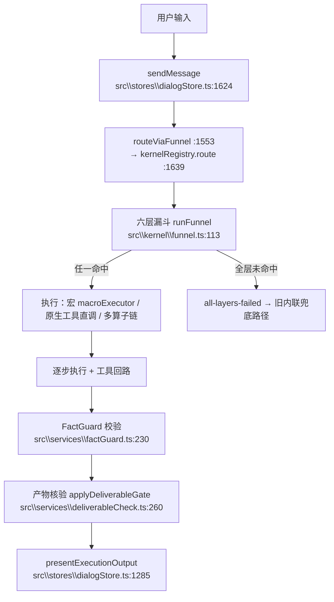

# 20 · 请求生命周期与路由

> 复核到 HEAD `9a957e4` · 2026-10-09 · 等级标记见 [README](README.md)

---

## 一条输入走完全程

- **主路径是漏斗**：`sendMessage` 无条件走 `routeViaFunnel` → `kernelRegistry.route` → 内核插件 `route()` → `runFunnel`。旧的「内联六层」实现已降级为漏斗抛错时的兜底分支。
- 全程经 `apiStore.chatCompletion` 注入上下文：`[用户偏好]` / `[会话记忆]` / `[知识库检索结果]` / 原生工具 schema（见 [50-记忆与上下文](50-记忆与上下文.md)）。

---

## 六层漏斗

| 层 | 做什么 | 默认实现 | 层壳 |
|---|---|---|---|
| L0 | 规则路由（内置规则表首中即返回） | `src\services\l0SkillRouter.ts:795` `tryL0Skill` | `src\kernels\default\index.ts:323` |
| L0.5 | 关键词快配（单步 manifest） | `l0SkillRouter.ts:812` `tryL05QuickMatch` | `src\kernels\default\index.ts:342` |
| L1 | 单节点能力直调 | `l0SkillRouter.ts:885` `checkL1Capability` | `src\kernels\default\index.ts:385` |
| L2 | 宏清单匹配（RaaP）+ 歧义消解 | `src\services\toolRetrieval.ts:655` `universalMatch` | `src\kernels\default\index.ts:403` |
| L3 | LLM 仲裁（仅 ≥2 候选时） | `toolRetrieval.ts:916` `llmFallback` | `src\kernels\default\index.ts:484` |
| L4 | 探索模式（无 shell 自动执行） | `l0SkillRouter.ts:1130` `buildExplorePlan` | `src\kernels\default\index.ts:509` |

**门值与层序** `[已复核]`

| 项 | 值 | 位置 |
|---|---|---|
| `l05Pass`（L0.5 过门） | **0.6** | `src\kernel\funnel.ts:36` |
| `l05Auto`（高置信自动执行，另需计划无 shell） | 0.9 | 同上 |
| `l1Pass`（L1 过门） | 0.6 | 同上 |
| `LAYER_ORDER` | `['L0','L0.5','L1','L2','L3','L4']` | `src\kernel\funnel.ts:102` |

> `l05Pass` 2026-09-30 由 0.8 下调到 0.6：原值等价于 `hitRatio ≥ 0.533`，实测 L0.5 对典型输入只有约 8% 命中（近死层）；且当时该门被内层硬编码 0.8 遮蔽、调低无效。内层硬门现已移除，**漏斗 gate 是唯一过门判定点**。

---

## 路由打分公式 `[已复核]`

分母是这套公式的核心特征：`denom` 被 `min(..., 3)` 夹住，**条目自身的关键词表越长越难达标**。

| 层 | 公式 | 位置 |
|---|---|---|
| L0.5 `hitRatio` | `matchedKws.length / kws.length`（刻意不归一化） | `src\services\l0SkillRouter.ts:834` |
| L0.5 `confidence` | `top.hitRatio >= 0.4 && margin >= 0.1 ? Math.min(top.hitRatio * 1.5, 1.0) : 0` | `l0SkillRouter.ts:863` 附近 |
| L1 `confidence` | `denom = Math.min(rule.keywords.length, 3)`；`Math.min(matchedKwCount / denom * 2, 0.9)` | `l0SkillRouter.ts:1072-1073` |
| L2 关键词 `score` | `denom = Math.min(keywords.length, 3)`；`hits / denom` 上限 1 | `src\services\toolRetrieval.ts:398` |
| L2 green 门 | `GATE_GREEN_THRESHOLD = 0.95` | `toolRetrieval.ts:299` |
| L2 向量歧义下界 | `VECTOR_AMBIGUOUS_LOW = 0.55` | `toolRetrieval.ts:298` |
| L0 内置规则数 | **12** 条（数组 `skillRules`，每条带一个 `buildPlan`） | `l0SkillRouter.ts:272` 起 |
| L2 清单 | 配置文件 **20** 个；`src\data\l2Manifests.ts` 内登记 **27** 条 identity | `config\l2_manifests\`、`src\data\l2Manifests.ts` |

> ⚠️ **两处计数不一致**（20 vs 27）是既存事实：`config\l2_manifests\` 是磁盘清单，`l2Manifests.ts` 是代码内登记。统计 L2 覆盖时说明用的是哪一个。

---

## 组合意图（近期主线机制）`[已复核]`

2026-10 的机制化成果：**一个动作要求产出多个目录 / 多步算子**（例：「把桌面图片按类型分好，再放进'整理'文件夹」）。

**表驱动，加组合 = 加数据不改代码**：

| 部件 | 位置 | 说明 |
|---|---|---|
| 引擎 | `src\services\compositeIntent.ts:277` `matchCompositePlan` | 四段顺序：`$missing` → filter unmapped → 按特异性打分 → 全不中则下沉 |
| 数据表 | `src\data\compositeCombos.json` | 唯一数据源；条目形状 `ComboEntry` / `ComboPlanStep` / `ComboWhen` |
| 动作家族 | `compositeIntent.ts:34` `ACTION_FAMILIES`（8 个）+ `:51` `SEQUENCE_MARKERS` | 判「是否组合请求」 |
| 判据 | `compositeIntent.ts:64` `looksComposite` | ≥2 个动作家族，或顺序连接词 + ≥1 家族 |
| 过滤器安全 | `compositeIntent.ts:171` `resolveCollectFilter` | 显式扩展名 → 单扩展名；类型词 → 扩展名集；**歧义词**（文档/资料/材料/东西/内容）→ 判 unmapped 并要求澄清；都没有 → 空过滤器（用户字面说「文件」= 全部） |
| 打分 | `compositeIntent.ts:234` `comboScore` | 非通用家族数 × 100 + 家族总数（`mkdir`/`move` 视为通用） |
| 渲染 | `compositeIntent.ts:240` `render` | 占位符 `{dir}` `{target}` `{folderName}` `{extLabel}` `{ext}` `{toExt}` |
| 缺口登记 | `src\data\compositeCombos.json:78` `$missing` | **优先级高于 combos**：没有算子时如实说明，绝不产出「少做一半」的计划 |

**缺口登记册（CI 编号）**——契约面登记在 `test\unit\compositeIntents.spec.ts` 的 CI-XX 用例，数据面登记在 `compositeCombos.json` 的 `$missing`：

| 编号 | 场景 | 状态 |
|---|---|---|
| CI-01 / CI-02 | 建目录 + 归类（含换说法） | ✅ 已实现 |
| CI-03 | 批量转 PDF + 归档 | ✅ 已实现（给 `file_convert` 补批量参数） |
| CI-04 | 重命名 + 归类 | ✅ 已实现 |
| CI-05 | 解压 + 归类 | ✅ 已实现 |
| CI-06 | 按类型分拣 | ✅ 已实现 |
| CI-07 | 改扩展名 + 归类 | ✅ 已实现 |
| — | **转非 PDF（docx/xlsx）再归类** | ❌ **仍是缺口**（`$missing` 里唯一剩余项） |

**算子族**（纯计划核心，落在 `electron\`）：

| 算子 | 工具名 | 实现 |
|---|---|---|
| 按类型分拣 | `file_sort_by_type` | `electron\fileSortByType.ts:67` `planSortByType`（只处理目录**顶层文件**，不递归） |
| 解压并归类 | `file_unzip` | `electron\fileUnzip.ts:46` `planUnzip`（仅 zip；每个包解成同名子目录） |
| 批量改扩展名 | `file_rename_ext` | `electron\fileRenameExt.ts:34` `planRenameExt`（就地换后缀；toExt 空或与 fromExt 相同 → 空计划，fail-closed） |
| 批量转格式 | `file_convert`（批量形态） | `electron\fileConvertBatch.ts:33` `planConvertBatch` |

登记处保持三处一致：`src\services\toolRegistry.ts:21/24/26`（名单）+ `:56-58`（副作用工具）、`src\services\writeGate.ts:21` + `:38-40`（写类标签）。这些工具**刻意不注入模型工具表**，只作确定性 L0 计划的入口。

**与单动作规则互不抢占**（两道守卫）：

1. **候选守卫**：L2 的三个候选产生点都加 `if (looksComposite(input)) return { kind: 'miss' }`——组合请求不出候选，直接下沉 L3/L4。位置：`src\kernels\default\index.ts:249` / `:303` / `:440`。
2. **规则禁止词**：L0 的「文件创建」规则加 `forbiddenPatterns` 挡归类句式；「创建文件夹」规则禁域词；组合规则「建文件夹并归类文件」（`src\services\l0SkillRouter.ts:541`）的 `forbidPatterns` 把含域词（周报/报告/合同/翻译…）的请求交回 L2。

---

## 省 token：实测口径（不是宣称）`[实测·2026-10-07 CDP 探针，本轮未重跑]`

给 `apiStore.chatCompletion` 打桩实测（探针 `.rivet\scratch\measure-args.mjs`）：

| 项 | 一次普通请求的实测值 |
|---|---|
| LLM 调用次数 | **1 次** |
| messages | 1444 字符 |
| **tools（14 个原生工具 schema）** | **5832 字符（占 payload 80%）** |
| prompt / completion | ≈ 3482 / 211 token |

**结论**：开销来自**每次请求固定背着的工具定义**，不是「多调一次规划调用」。

**真正省 token 的地方**：L2 宏命中时 **+0 token**（DAG 各步确定性执行）。

**不能简单删工具**：`src\services\macroExecutor.ts:697`、`:745` 挂 `tools` 是有据的修复——此前宏步骤不传 tools，模型会回「我无法访问你电脑上的本地路径」导致考试题失败；去掉即回归。

---

## 两个语义陷阱

1. **`routeKind` 区分不出层**。各层产出的计划 `routeKind` 都是 `plan`；真正的层在 `funnel:routed` 的 `source`（验收报告里是 `routeLayer`）。按 `routeKind` 做的分层统计一律不可靠。
2. **兜底路径的门值与主路径不同**。`dialogStore` 的旧内联兜底分支里 L0.5 仍硬编码 `0.8`，与漏斗 gate 的 `0.6` 不一致——主路径异常回退时口径会变。`[未证实]`——本轮未复核该分支的确切行号与影响面。
