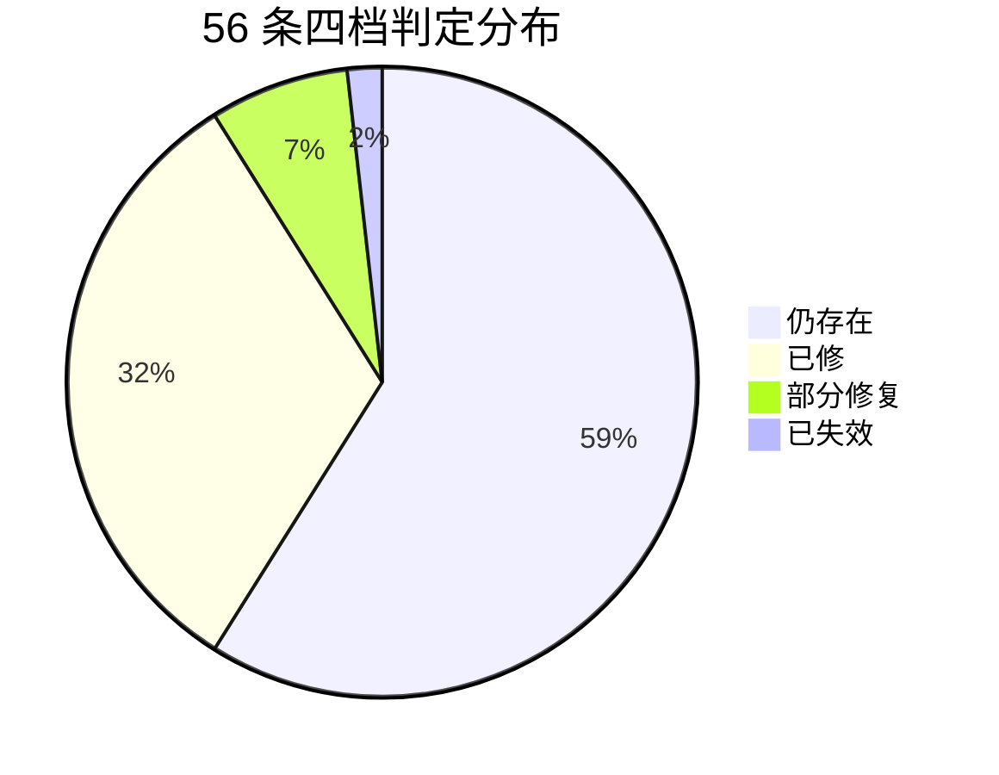

# HoloStarmap 完整现状快照（2026.9.26 复核）

> **承接**：`2026.9.24最新快照.md`（E/H/S/K/D/T/X 共 56 条）、`.rivet\PLAN.md`（A/B 段）。
> **本快照范围 = 完整现状**：把项目**全部在册问题**逐条在当前代码里复核，给出「已修／部分修复／仍存在／已失效」四档判定 + 可复核 `file:line` 落点。
> 覆盖的分源：9.24 快照 §一~§七（56 条）、9.24 §〇 基线表（G/F 系列）、`最新口径.md` 的 F-6/F-7/F-8 与两条空缺边界、`.rivet\PLAN.md` 的 A 段/O1–O10/B 段、`MECHANISM-ROT-AUDIT-2026-09-25.md`、`MECHANISM-DORMANCY-2026-09-26.md`、`LIFECYCLE-GAPS.md`、`AUDIT-REPORT-2026-09.md`、`.rivet\HANDOFF.md` 的卡点与下一步。
> **复核基准**：分支 `feat/model-collaboration` @ HEAD `cc0e0af`；工作树仅 `exam-report.json` 为 `M`（考试导出产物，按惯例不提交）。
> **口径（重要）**：全部判定来自 **grep/read_file 静态核验**，**不取信任何文档转述与状态标记**——本轮已证多份旧文档的状态与代码相反（见 §十四）。**「已修」= 修复代码在库且接线完整，不等于端到端行为已复跑**；本轮的运行级证据只有 `npm run typecheck`（exit 0）与磁盘成绩单，逐题行为未重跑。

---

## 修复动态记录

### 2026-09-26（删除星图视图：工作台成为唯一 UI 模式）

- **Wave 1（`d03ef0c`，-4608/+40 行）**：删掉 125 节点 3D 星图这一整条 UI 模式——`src\composables\useThreeScene.ts`（2899 行）、`src\components\StarMap.vue`、`FilterBar.vue`、`NodeDetailPanel.vue`、`DebugProbePanel.vue`；`App.vue` 去掉星图模板块/两个切换钮/相机与节点交互 handler/星图轮询；`configStore` 与 `UserConfig` 移除 `uiMode`、`starmapNodeDensity`；`WorkbenchNav` 去掉「星图」入口。**老配置兼容**：采用「删字段」而非「改造开关」——旧 vault 里的 `uiMode:'starmap'` 被结构性忽略，不可能再指向已删除的视图（新增回归测试，RED 时 `store.uiMode === 'starmap'`）。
- **Wave 2（`cbb66b5`，-676 行）**：`nodeStore` 清扫星图专属死状态。逐条 grep 证零生产引用后删除：拖拽/重力/连线流/滤镜/`validateSchema`/L3 衰减/节点视觉事件/连接流/DAG 写入方等；**保留** `nodes`/`l1Nodes`/`l2Nodes`/`l3Nodes`/`l2Manifests`/`getL2Manifest`/`getVisibleL2Ids`/`l1WorkStatus`/`dagChainState` 等有生产引用者（工作台 `RuntimePanel`/`StatusBar`、`DialogPanel`、`ToolSelector`、`SettingsPage`、`domains\node` 总线处理器、dialogStore 路由上下文）。`nodeStore.spec.ts` 同步收口。
- **Wave 3（`ac0d4a1`）**：`launch.spec.ts` 的「看到 3D 星图 DOM」断言改为**显式断言工作台 `wb-shell` 且不含 `starmap-container`**——原断言是 `canvas|three|WebGL|starmap` 的 `||` 串联，删了星图仍会被根类名 `holo-starmap` 兜住而**假绿**；工作台运行面板补「⏹ 终止执行」入口（`DebugProbePanel` 是窗口内唯一下令点，随星图删除后主窗会失去该能力）。
- **计划偏离（逐条记录，未静默改道）**：
  1. **计划假设被证伪**：「`node:*` 处理器只服务星图 UI」不成立——`node:get-nodes`/`get-l2-manifest`/`get-all-l2-manifests`/`get-visible-l2-ids`/`get-selected-role`/`get-selected-node`/`get-roles`/`set-l1-status` **全被 `dialogStore` 请求**（路由上下文 + StatusBar L1 状态），是活的基础设施 ⇒ **保留**；仅 `node:select-node`/`node:get-context` 零请求方，但项目此前已有「保留域处理层」裁决 ⇒ `src\domains\node\handlers.ts` **未动**。
  2. **测试收口前移**：Wave 3 的 spec 更新提前到 Wave 1 执行——否则旧 spec 引用已删字段，Wave 1 根本无法验证。
  3. **`dialogStore` 的 8 条死发射未删**（`node:set-dag-chain`/`update-dag-step`/`mark-task-chain-complete`/`clear-dag-chain`/`highlight-l2-candidates`/`dag-chain-push-step`/`dag-chain-set-deps`/`set-l0-red-flash`，约 19 处）——删除前已无监听（`handlers.ts` 从未注册），属**纯空转**；因散落在 3000 行文件中 19 处、且无功能收益，列为后续清理项。
- **本轮新发现**：工作台的「DAG 执行链」卡片（`RuntimePanel.vue:52`、`StatusBar.vue:19`）读 `nodeStore.dagChainState`，而该状态**从无写入方**（写入方是那 8 条已无监听的频道）⇒ 该卡片恒不显示，属既有缺陷、本次未修。
- **验证**：`npm run typecheck` **exit 0**；全量 `npx vitest run` → **159 files / 2313 tests / 2311 passed / 2 failed**（2 例仍为 `hotplugAcceptance` P3.6 环境类超时，与删除前同签名，**非本批引入**；用例数 2340→2313 系 `nodeStore.spec` 随死状态一并收口）。
- **未验证（诚实标注）**：**渲染/视觉未验证**——未起 dev server 截图；工作台在真实窗口下的渲染、以及新补「终止」按钮的点击行为均无端到端实测，本批证据只到「静态 + 单测」级。

### 2026-09-26（P1 收口批：H-1 / H-4 / H-6）

- **H-4**（`src\services\macroExecutor.ts`）：单步就绪路径的条件求值补传第三参 `cond.fromStep`——原实现只传两参，D-09 的「求值域收敛到来源步骤」只覆盖了并行分支。RED→GREEN 见 `test\unit\macroExecutor.cleanup.spec.ts`（RED 现象：条件扫到无关步骤里的数字而误判为真、未跳过下游步骤）。
- **H-6**（`src\services\macroExecutor.ts`）：把 `executeMacro` 拆成「控制器/收口外壳」+ `runMacroBody` 执行内核；外壳用 `try/finally` 保证**任意位置的抛出**都注销 abort 控制器、并给未收口的时间线补记 `failed`（与 `pipelineExecutor.ts` 末尾同构）。内核里 5 处提前 `unregisterAbort()` 收敛为外壳一处。RED→GREEN 见同 spec（RED 现象：异常路径 `debug:clear-abort` 未发射，`0 ≠ 1`）。
- **H-1**（`src\App.vue` + 新增 `src\services\canvasRun.ts`）：画布「运行当前画布」的载荷改经叶子纯函数 `buildCanvasPipeline` 构造 Pipeline，把 `dagNodes`/`dagEdges` 一并带给执行器——原实现只映射 `steps` 并丢弃 `edges`，`pipelineExecutor` 里那段按 dagEdges 拓扑排序的分支因此**永不可达**。新增 `test\unit\canvasRun.spec.ts`。
- **验证**：`npm run typecheck` **exit 0**；全量 `npx vitest run` → **159 files / 2342 tests / 2340 passed / 2 failed**（+2 文件 / +6 用例，均为本批新增；2 例失败仍为 `hotplugAcceptance` P3.6 环境类超时，**非本批引入**）。
- **未做**：画布运行的**渲染层视觉/端到端**未验证（本轮为纯函数 + 单测级证据）；`parallel` 仍不并行（按既有裁决显式告警，未新增并行调度）。

---

## 一、结论速览

| 分源 | 条目数 | 已修/已闭合 | 部分修复 | 仍存在 | 已失效 |
|---|---|---|---|---|---|
| E 系列（主进程/IPC/安全） | 15 | 4 | 1 | 10 | 0 |
| H 系列（管道/DAG/宏） | 17 | 6 | 0 | 11 | 0 |
| S 系列（流式/Provider） | 8 | 5 | 2 | 1 | 0 |
| K 系列（知识库/向量） | 7 | 2 | 0 | 5 | 0 |
| D 系列（导入导出） | 2 | 0 | 1 | 1 | 0 |
| T 系列（计量/计价） | 5 | 0 | 0 | 5 | 0 |
| X 系列（考试器） | 2 | 1 | 0 | 0 | 1 |
| **56 条合计** | **56** | **18** | **4** | **33** | **1** |
| G/F 系列（§〇 表 + 最新口径） | 22 | 17 | 2 | 3 | 0（另 2 空缺、3 无法判定） |
| PLAN A/B + O1–O10 | 21 | 16 | 2 | 1 | 2（前提失效） |
| ROT-AUDIT / DORMANCY | 12 | 5 | 2 | 5（多为按裁决保留） | 0 |

**一句话现状**：安全四连（E-1~E-4）、流式五连（S-1~S-5）、**宏执行 P1 三连（H-1/H-4/H-6，2026-09-26 补齐）**、知识摄取真做（K-1/K-3）、考试器（X-1/X-2）、F-6/F-7 与三项「机制体检真死」已全部翻案；**存量集中在 E 系列的 P2/P3 有界性与生命周期、H 系列的 P2/P3（插件生命周期与 checkpoint）、K/T 系列的隔离与口径、以及 G-15/G-16 两条「接了口径但未校准/未隔离」**。

---

## 二、E 系列：主进程 / IPC / 文件系统 / 安全（15 条）

| # | 原断言 | 判定 | 本次实测落点 / 依据 |
|---|---|---|---|
| **E-1** P1 | 主窗无 `will-navigate` 防护 + 全部 HTML 入口无 CSP | ✅ 已修 | `electron\navigation-guard.ts`（`guardWindow`/`isAllowedNavigationTarget`）；`electron\window-manager.ts:24/73/133/191/245/293` 对五窗挂载；`index/pipeline/debug/benchmark/rule-review.html` 各有 CSP meta |
| **E-2** P1 | 黑名单漏 `.lnk`/`.url` → 落盘快捷方式 + openPath = RCE 闭环 | ✅ 已修 | `electron\pathValidator.ts:51` `SAFE_OPEN_EXTENSIONS`；`:86` 补 `.lnk/.url/.application/.appref-ms`；`:220/232` `validateOpenPath` 改白名单 fail-closed |
| **E-3** P1 | node -e 写路径 `..` 穿越可绕白名单 | ✅ 已修 | `electron\shell-security.ts:141` `resolveNodeWriteTarget`（先 `resolve` 规范化）；`:180/231` `isAllowedNodeWriteTarget` 再过危险扩展名；`:256` `isMcpCommandAllowed` 拒 `-e/--eval/--print` |
| **E-4** P1 | `backup:restore` 只交换 store、静默丢 vaults/knowledge | ✅ 已修 | `electron\backupRestore.ts:9/14/15/83` `planRestoreTargets` 规划三类目标；`ipc-handlers.ts` restore 调 `applyRestore`、create 调 `wal_checkpoint(TRUNCATE)`（`vault.ts:36-45`） |
| **E-5** P2 | `http:fetch` 超时只覆盖响应头，body 读取阶段无 abort | ❌ 仍存在 | `electron\ipc-handlers.ts:975-988` 计时器在 `finally` 清；`:1009` `await readBodyCapped(resp)` 已无活跃 signal |
| **E-6** P2 | LLM 通道 `resp.json()` 无大小上限 | ❌ 仍存在 | `electron\ipc-handlers.ts:1241`（chatCompletion）、`:1342`（listModels）整读；`readBodyCapped` 仅用于错误体 |
| **E-7** P2 | `llm:stream:start` 无 sender 存活检查 → AbortController 泄漏 | ❌ 仍存在 | `electron\ipc-handlers.ts:1528-1786` 循环内 `event.sender.send` 全无 `isDestroyed` 守卫；catch 中 error send 抛则 `delete` 不可达 |
| **E-8** P2 | 文档承诺的单实例锁未实现 | ✅ 已修复 `d789375` | `electron\main.ts` 启动即 `app.requestSingleInstanceLock()`（未持锁 `app.quit()` + `second-instance` 聚焦主窗）；真双实例实测：有实例在跑时二次启动 1.09s 内 exit 0、既有实例进程数不变，无其他实例时同一命令长驻 |
| **E-9** P2 | afterPack 全量复制开发 node_modules | ❌ 仍存在 | `build-after-pack.js:9-16` 源为 `projectDir/node_modules`，`:18-31` 全量递归，无白名单子集 |
| **E-10** P3 | 主进程持久化写入非原子 | ❌ 仍存在 | `electron\ipc-handlers.ts:336/377/439/687/1372/1462` 六处 `writeFileSync` 直写目标，无 temp+rename |
| **E-11** P3 | 写通道容量上限口径不一致 | ❌ 仍存在 | `vector:writeBin`(:330-342)、`store:write`(:682-693)、`vault:write`(:1507-1510) 均无上限（对照 file:write 10MB） |
| **E-12** P3 | macOS `activate` 不重注册快捷键 | ❌ 仍存在 | `electron\main.ts:154-156` activate 仅 createWindow；`:170-177` window-all-closed 注销且不重注册；fsWatcher 无全关清理 |
| **E-13** P3 | `store:syncToPipeline` 无加载期队列 | ❌ 仍存在 | `electron\main.ts:62-65` 直接 send 不判 isLoading（对照 `:42-53` addNode 有 pending 队列、`:121-134` syncToDebug 有队列） |
| **E-14** P3 | vault schema 无迁移机制 + 死参数/死表 | ❌ 仍存在 | `electron\vault-schema.ts:1-28` 仅 `CREATE ... IF NOT EXISTS`，无 `user_version`；`vault.ts:20-27` `openVault` 单例使 `userId` 永不生效 |
| **E-15** P3 | `file:move` 源校验口径不一致；`file:list` 双 readdir | 🔶 部分修复 | `file:list` 已改单次 `withFileTypes` 遍历（`electron\fileListing.ts:60-64`）；**`file:move` 源仍走 `validatePath` 而非 `validateReadPath`**（`ipc-handlers.ts:448-472`） |

---

## 三、H 系列：插件运行时 / DAG 管道 / 宏执行（17 条）

| # | 原断言 | 判定 | 本次实测落点 / 依据 |
|---|---|---|---|
| **H-1** P1 | `parallel` 是假的、画布 DAG 依赖边被执行器忽略 | ✅ 已修 | 执行器侧本就有按 `dagEdges` 拓扑排序的分支（`pipelineExecutor.ts:262-284`，`test\unit\pipelineDagOrder.spec.ts` 覆盖）；**本轮补上缺失的调用方接线**——`App.vue:519-527` 改经叶子纯函数 `src\services\canvasRun.ts` 的 `buildCanvasPipeline` 构造 Pipeline，把 `dagNodes`/`dagEdges` 一并带上（`test\unit\canvasRun.spec.ts`）。`parallel` 仍按顺序执行并显式 `console.warn`，不假装并行 |
| **H-2** P1 | L2 双击直达因 id 命名空间不一致整条死 | ✅ 已修 | `nodeStore.ts:425` `normalizeL2Id`、`:431/442` 双查；`domains\node\handlers.ts:48-50` |
| **H-3** P1 | 未注册工具 fail-open（标 completed、整体成功） | ✅ 已修 | `pipelineExecutor.ts:324` `pipelineFailed`、`:353-359` 置 failed 并 `throw`、`:464` `wfComplete('failed')` |
| **H-4** P1 | 单步就绪路径条件求值缺 `fromStep`（D-09 只修一半） | ✅ 已修 | `macroExecutor.ts` 单步分支改传第三参 `cond.fromStep`（与并行分支同口径）；`evaluateCondition` 定义在 `:791`。回归：`test\unit\macroExecutor.cleanup.spec.ts`（RED 时因扫全量结果、命中无关步骤的数字而误判 `$.output.amount > 100`，未跳过下游步骤） |
| **H-5** P1 | 取消后仍入指纹缓存 / checkpoint 不清理 / 时间线记完成 | ✅ 已修 | `macroExecutor.ts:1570-1575` `removeCheckpoint`、`:1588-1596` aborted 跳过 `saveExecutionFingerprint`、`:1620` `wfComplete('failed')` |
| **H-6** P1 | `executeMacro` 主循环无 try/finally → 泄漏 abortController | ✅ 已修 | `executeMacro` 拆为「控制器/收口外壳 + `runMacroBody` 内核」：外壳 `try/finally` 保证任意抛出都 `debug:clear-abort` 注销控制器、并给未收口的时间线补记 `failed`（与 `pipelineExecutor.ts` 末尾同构）；内核 5 处提前注销点收敛为 1 处。回归：`test\unit\macroExecutor.cleanup.spec.ts`（RED：异常路径 clear-abort 未发射 0≠1） |
| **H-7** P2 | `llm_generate` 工具回路吞 AbortError | ❌ 仍存在 | `macroExecutor.ts:514-516`、`:534-535` 均为 `catch { return lastOut }`，无 AbortError 判定 |
| **H-8** P2 | 工具回路续跑轮次无步骤级超时 | ❌ 仍存在 | `macroExecutor.ts:450` 首轮成功即 `clearTimeout`；`:489/:526` 续跑/收口无新计时器 |
| **H-9** P2 | `mountPack` 无并发互斥 → 记录覆盖与卸载泄漏 | ❌ 仍存在 | `loader.ts:281` has 检查 → `:405` set 之间全是 await；`:460` `reloadChain` 只包 `reloadPack`，mount/unmount 未入链 |
| **H-10** P2 | 僵尸插件无清除通道；`withTimeout` 不取消底层 mount | ❌ 仍存在 | `pluginRegistry.ts:149` 置 zombie；`:97-101` register 拒、`:171-172` unregister 拒；`:293-301` `withTimeout` 仅 reject |
| **H-11** P2 | pipelineExecutor 私有 checkpoint：resume 无调用方 + 无 TTL/上限 | ❌ 仍存在 | `pipelineExecutor.ts:216-240` 无 TTL/容量；`:245` `resumeFromCheckpoint` 唯一调用方 `App.vue:531` 未传 true |
| **H-12** P2 | 计划与运行时对「被跳过依赖」语义不一致 | ❌ 仍存在 | `scheduleOptimizer.ts:466`（计 `skipSteps` 满足）vs `macroExecutor.ts:1509`（只认 `stepDone`） |
| **H-13** P2 | 数据流预检盲区（`workspace_dir`/`user_file_2` 不校验） | ❌ 仍存在 | `scheduleOptimizer.ts:266/268` 只匹配 `step_N_result`；`l2Manifests.ts:92/99`（workspace_dir）、`:204/210`（user_file_2） |
| **H-14** P3 | 98 个 L3 装饰占位 + 孤儿 manifest | 🔒 **L3 占位保留**（用户填充中）／孤儿 manifest 待补 | `topology.ts:184` 循环 98——**2026-09-27 用户裁定：L3 装饰占位为预留位，不得删（数据与 UI 都不删）**；L2 模板 20 条（`:96-116`）；`l2Manifests.ts` 现有 27 个 `identity`（历史 4 个孤儿仍在，另有新增待做集合差） |
| **H-15** P3 | `paramMapping` 的 clipboard 槽位未实现 | ❌ 仍存在 | `macroExecutor.ts:758-759` 恒解析为 `''`；`models\index.ts:718` schema 仍允许声明 |
| **H-16** P3 | `externalSignal` 监听器跨重试累积 | ❌ 仍存在 | `macroExecutor.ts:427-430` 降档循环内 `addEventListener`，成功路径无对应 `removeEventListener` |
| **H-17** P3 | 流水线中间产物写入 default 会话记忆并被回读 | ❌ 仍存在 | `pipelineExecutor.ts:402-403` `addMessage('default',…)`；`:110/118` workspace-memory 从 `default` 读回 |

---

## 四、S 系列：流式 / Provider 链（8 条）

| # | 原断言 | 判定 | 本次实测落点 / 依据 |
|---|---|---|---|
| **S-1** P1 | 角色绑定与「大模型兜底」对 Ollama 目标完全失效 | ✅ 已修 | `apiStore.ts:777`（非流式直连）、`:1133`（流式）均改 `resolveDirectTarget`；定义 `modelRoles.ts:82` |
| **S-2** P1 | 桌面流式主路径（IPC）失败不降级 | ✅ 已修 | `apiStore.ts:1253` onError 调 `tryStreamDegrade`；`:1388` 定义；`:1546` 直连分支共用 |
| **S-3** P1 | IPC 流式 `cacheHitTokens` 丢弃 | ✅ 已修 | 新增 `electron\streamUsage.ts:48` `parseStreamUsage`；`ipc-handlers.ts:1719/1749/1755/1776` 透传真实值；消费端 `apiStore.ts:1233` |
| **S-4** P1 | 流中断与服务端 error 事件被当「成功」 | ✅ 已修 | `sseParser.ts:51/88/197` 补 error 分支与 EOF 截断标记；`ipc-handlers.ts:1776` EOF 发 `truncated:true`。**残留**：主进程按 `split('\n')` 未 join 多行 data（单行 JSON 下影响低） |
| **S-5** P2 | 流式预算检查不豁免降级态 | ✅ 已修 | `apiStore.ts:1124` 补 `!degradeState`，与非流式 `:641` 同口径 |
| **S-6** P3 | 委托非流式时返回空 cancel → 该路径不可取消 | 🔶 部分修复 | `App.vue:600/614` 已传 `signal`（取消链经 signal 已通）；**委托分支仍 `return { cancel: () => {} }`**（`apiStore.ts:1116`） |
| **S-7** P3 | 计时器从不 dispose + 流式超时为「整流总时长」 | 🔶 部分修复 | dispose 已补（`apiStore.ts:1040/1214/1249/1262/1267/1556`）；**超时仍为整流总时长**（`:1143`），无空闲/活跃区分 |
| **S-8** P3 | providerChain 探测无 in-flight 去重 | ❌ 仍存在 | `providerChain.ts:149` `probeChainTarget` 不共享进行中的 promise，N 个并发 miss 各自探测 |

---

## 五、K 系列：知识库 / 向量机制（7 条）

| # | 原断言 | 判定 | 本次实测落点 / 依据 |
|---|---|---|---|
| **K-1** P1 | PDF/Office 摄取是占位符假实现 | ✅ 已修 | `knowledgeBase.ts:222` 改调 `docExtractText`（能力缺失即抛，绝不返回占位符）；`electron\docExtract.ts:55` 真提取（pdf-parse/mammoth/xlsx）；`ipc-handlers.ts:475` 注册 `doc:extractText`；`preload.ts:261` 暴露 |
| **K-2** P2 | convMemory 水位线不持久化 + `ingestText` 无去重 | ❌ 仍存在 | `convMemory.ts:25` 模块级 `lastIndexTimestamp` 无 vault 读回；`knowledgeBase.ingestTextCore` 无指纹去重（对照 `ingestFile` 有） |
| **K-3** P2 | 索引解析失败静默清空全库 | ✅ 已修 | `knowledgeBase.ts:36-41` `readEntriesStrict` 走 `parseJsonSafe`；`:57-64` 损坏时 `throw` fail-closed |
| **K-4** P2 | `knowledgeMigration` 绕过写锁 | ❌ 仍存在 | `knowledgeMigration.ts:96` read / `:112` write，全程不持 `knowledgeBase` 私有 `withEntriesLock`（`knowledgeBase.ts:69`） |
| **K-5** P3 | KB 去重指纹为 32-bit 弱哈希 | ❌ 仍存在 | `knowledgeBase.ts:119-125` djb2 32 位；`:252` 命中即返回旧 entry、不比内容；`semanticCache.ts:134` 的强哈希未复用 |
| **K-6** P3 | `clearConvMemory` 键名错误 + 零调用 | ❌ 仍存在（**措辞订正**） | `convMemory.ts:124` 仍删键 `'holo-conv-chunks'`（无写入方）；**生产零调用**，但已被 `test\unit\convMemory.spec.ts` 调用——原文「全仓零调用」不再准确 |
| **K-7** P3 | 主进程存在第二套「影子知识库」零消费者 | ❌ 仍存在 | `ipc-handlers.ts:1351/1379`（写 `userData\knowledge\`、`String.includes` 检索）；暴露链 `preload.ts:261` → `kernel\facades\io.ts:112` → `kernel\index.ts:52`；除 facade 定义外无生产消费者 |

---

## 六、D / T / X 系列（9 条）

| # | 原断言 | 判定 | 本次实测落点 / 依据 |
|---|---|---|---|
| **D-1** P2 | `applyImport` 对导入内容零校验 | 🔶 部分修复 | `dataExporter.ts:3/219-227` 已接 `importValidation`；**但 baseUrl 仅 `isHttpUrl`（`importValidation.ts:26-44`）、向量仅结构校验（`:66-89`）** ⇒ 缺 host 白名单 / 维度 / `vectorIsPseudo` 重算 |
| **D-2** P3 | 导入文件读取无大小上限 | ❌ 仍存在 | `dataImporter.ts:6-13` `readAsText` 无检查；`ipc-handlers.ts:1477` `data:importZip` 无上限（对照 knowledge:ingest 10MB） |
| **T-1** P2 | 语义缓存键缺 taskType/模型 → classify 与主对话互相污染 | ❌ 仍存在 | `semanticCache.ts:170-172` `exactKey = hash\|domain\|packId`；`:229-266` lookup 不比 tier/model；`apiStore.ts:524` `cacheEligible` 只看 tools/消息数 |
| **T-2** P2 | `detectUnsolvable` 误报——主模型正常回答被冠 small-only 横幅 | ❌ 仍存在 | `escalationPolicy.ts:21-30` 模式一/三原样、`:58-66` 文案仍称「只配置了小模型」；`apiStore.ts:726/885/992` 守卫是 `!forceTarget` 而非 `role` |
| **T-3** P3 | DEV 环境 token 双重记账（`_skipNextCapture` 顺序相反） | ❌ 仍存在 | `apiStore.ts:697` `debugLog` 先于 `:721` `emitRecordCost`；`debugStore.ts:127-136/186-195` |
| **T-4** P3 | 实际计价全链扁平 `userPricing`，分档价只在估算侧 | ❌ 仍存在 | `tokenBudget.ts:241-243` `calculateCost`；`tokenPricing.ts:6-11` 分档价仅供 `calculateCostByTier`/`estimateStepCost` |
| **T-5** P3 | kernel dispatch LLM 路径若启用会双重记账（潜伏） | ❌ 仍存在 | `kernel\index.ts:192-195` `estimateCost` + `budget.record`；`clusters\budget.ts:17-25` 同账本；无生产调用方（`grep .dispatch(` 仅 `kernelRegistry.ts:193` 自身） |
| **X-1** P1 | 判卷 provider 配置漂移，成绩单不可判 | ✅ 已修 | 磁盘 `exam-report.json`：`judgeErrors=0`、`judgeable=18`；`electron\apiConfigStore.ts` 多源读取；`examRunner.ts:454-467` `judgeErrors` 单列剔除分母 |
| **X-2** P1 | 10/18 题回复为空、疑似指纹缓存重放 | ✅ 已失效 | 当前成绩单**无空 `replyExcerpt`、无「无回复内容」**；`apiStore.ts:534-535` `isExamTraffic → isLearningIsolated`，`:592/600` 缓存读写对 exam 流量跳过 |

---

## 七、G / F 系列（9.24 §〇 基线表 +《最新口径》的 F-6/F-7/F-8 与两条空缺边界）

| 条目 | 原断言 | 判定 | 本次实测落点 / 依据 |
|---|---|---|---|
| G-1 | 消费者 800 字截断悬崖（静默截断） | ✅ 已修 | `macroExecutor.ts:658` `truncateWithNotice`（带「⚠️【已截断】」文案），`:664-670` 按 tier 设限 |
| G-3 | FactGuard 保护窗口仅前 5000 字 | ✅ 已修（窗口） | `factGuard.ts:61` `extractEntitiesAll`（分段+重叠，`:48` 常量）；三处调用均替换。**注**：`TRIGGER_ROLES` 仍限 finance/legal/hr |
| G-6 | 双引擎审核费效倒挂 | ✅ 已修（读类） | `dualEngineValidator.ts:128` 对 `read_file`/`list_directory` 改为仅目标路径敏感时才审（注释标 G-6） |
| G-7 | 降档重试是安慰剂 / `models[0]` 盲选 | ✅ 已修 | 据文档 `d1c1562`（本轮未独立复核该提交，标「据文档」） |
| G-9 | 熔断重试暗坑（含 anthropic 硬编码 max_tokens） | 🔶 部分核验 | `ipc-handlers.ts:1205` `max_tokens: maxTokens\|\|4096`（已参数化）；「重试预算真正可用」本轮未在 src 定位到对应改动 |
| G-10 | L0 藏 LLM 调用（便宜调用→便宜模型） | ✅ 已修 | 据 §〇 表 + `modelRoles.ts` role 分派（`AUX_CALLER_PREFIXES` 含 `l0SkillRouter`） |
| G-11 | L1 近乎死层 / `requiredL1` 零消费者 | ✅ 已修 | `l1Capabilities.ts:20/46` 权威注册表 + `auditRequiredL1`；`kernels\default\plugin.ts:58` 挂载期校验；`kernels\default\index.ts:101/122` 消费进 `plan.needs` |
| G-12 | L0.5 未排除多步 manifest | ✅ 已修 | `l0SkillRouter.ts:600-606` `isSingleStep` 门（文档行号 514-518 已漂移） |
| G-13 | 指纹缓存重启失忆 | ✅ 已修 | `scheduleOptimizer.ts:84/89/112/119` `persistToStore` 连 `results` 一起存、`loadPersistedFingerprints` 读回 |
| G-14 | 全字符串指纹零容错 | ✅ 已修 | `scheduleOptimizer.ts:150-166` `normalizeFingerprintText/Path`（空白/中英标点/大小写归一，刻意不做语义容错） |
| **G-15** | 置信门值 0.8/0.9/0.6 未校准 | ❌ **仍存在（可调未校准）** | `funnelGates.ts:26/37` + `dialogStore.ts:917/929/930` 覆盖通道在；**统计校准未做**（无测量数据，模块自述不宣称已校准） |
| **G-16 残留** | sessionMemory 只写不读 / 高频术语蒸馏 | 🔶 **部分修复** | 读取侧已接（`apiStore.ts:555` `buildSessionMemoryPrefix` 注入 `[会话记忆]`）；`archiveSession` 已接（`memoryStore.ts:143`、`dialogStore.ts:3406/3422`）；**高频术语隐式蒸馏未实现**；**写入侧无 `isLearningIsolated` 门**（`dialogStore.ts:299/329` → `memoryStore.ts:106` 无条件写入）——exam/benchmark 流量仍写入会话记忆 |
| F-3 | shell 错误消息 GBK 乱码 | ✅ 已修 | `electron\shellOutput.ts:19` `decodeShellOutput` 三级解码；`ipc-handlers.ts:886` 引用 |
| F-5 | 宏执行疑似阻塞新输入 | ❓ 无法判定 | 运行时现象，静态不可判；历史测量（CDP 往返延迟）未复现 |
| 质量报告项 | 依赖漏洞 / 未实测 | 🔶 部分处理 | `package.json:39` xlsx 换源成立（cdn.sheetjs.com 0.20.3 tgz）；electron/vitest/transformers 三案按用户裁定不动；`npm audit` 计数本轮未复核 |
| 复考遗留 | 模板误触发 | ✅ 已失效 | `forbiddenKeywords` 反向门（`l2Manifests.ts:256/441/470`）——Q4/Q14/Q15 类误投已处理 |
| **F-6** | `file_write` 原生 fast path 未接风险确认条 | ✅ **已修** | `dialogStore.ts:637` `requestWriteApproval('file_write', args)`（同处 `:654/668/683/712/723/740` 覆盖其余写类工具）；`macroExecutor.ts:150` 工具回路统一过门；`writeGate.ts` 定义 |
| **F-7** | tier 解析未覆盖流式/Ollama/direct-fetch | ✅ **已修** | `apiStore.ts:656`（非流式 IPC）、`:777`（direct/Ollama）、`:1097`（流式）均按 `tierTarget` 解析，不再写死 activeModel |
| **F-8** | `read_file` 两套口径未收敛 | ❌ 仍存在 | `dialogStore.ts:612` 直接传 `args.path`（**不展开 `%USERPROFILE%`**）；`macroExecutor.ts:355` 经 `resolveFilePath` 展开 |
| 空缺·数值计算边界 | 无「数值任务必须走确定性工具」规则 | ⬜ 空缺（证无） | 全仓 grep 无相关路由/强制规则（命中仅判卷侧） |
| 空缺·执行闭环边界 | 无「写脚本必须执行」收口 | ⬜ 空缺（证无） | 全仓 grep 无相关机制 |

---

## 八、PLAN.md A/B 段 + O1–O10 裁定

**A 段**

| 项 | 原断言 | 判定 | 落点 / 依据 |
|---|---|---|---|
| A1 · O1–O8 | 机制重叠仲裁待裁定 | ✅ 已裁定并落码 | 逐条落点见下 |
| A1b · O10 | 写类权限边界未审议 | ✅ 已落地 | `writeGate.ts`（`WRITE_TOOLS`/`requestWriteApproval`）；`macroExecutor.ts:27/142-148`；`domains\dialog\handlers.ts:22` |
| A2 | 全库无升级路径、`buildProviderChain` 只降不升 | ✅ **已失效**（前提不成立） | `escalationPolicy.ts:29/40/61`；`apiStore.ts:18/726-742` 升级重试 + 诚实陈述 |
| A3 | app 无 PDF 生成能力、pdf 分支第 2 步是假动作 | ✅ **已修** | `l0SkillRouter.ts:284/643` 走真 `file_convert`；`macroExecutor.ts:199-214` 调 `docConvertToPdf`；`l2Manifests.ts:55` |
| A4 | 验收线是否分阶段/分维度 | ❌ 仍存在 | `ACCEPTANCE-SPEC.md` 仍为单一总分线；无分维度报告实现 |

**B 段**

| 项 | 原断言 | 判定 | 落点 / 依据 |
|---|---|---|---|
| B1 | `{{step_N_top_files}}` 解析未实现 | ✅ 已修 | `listingPick.ts` + `macroExecutor.ts:774-783`；`dialogStore.ts:2075-2080` 复用 |
| B2 | Q14 清单不全 | ✅ 已修 | `fileListing.ts` 确定性收口（`list_directory+ext` 单步，不经模型） |
| B3 | Q15 图片按日期重命名 | ✅ 已修 | `imageRenameByDate.ts:84` + `l0SkillRouter.ts:487-495` + `macroExecutor.ts:187-190` |
| B4 | Q3/Q18（依赖 A3） | ✅ 已修 | 同 A3 |
| B5 | G-1/G-3 长文档 | ✅ 已修 | `macroExecutor.ts:658`（截断可观测）、`:875-877/:947-951`（全文分段抽取） |
| B6 | G-6 双引擎审核费效倒挂 | 🔶 部分修复 | `dualEngineValidator.ts:124-133` 读类已收窄；**审核调用 `maxTokens: 5000` 仍在** |
| B7 | 环境收尾清理 | ❓ 无法判定（静态） | 需运行时观测 |

**O1–O10 裁定落码**（裁决记录见 `MECHANISM-BOUNDARIES.md` §四）

| # | 裁定 | 落码证据 | 复核 |
|---|---|---|---|
| O1 | A 时序切分（FactGuard 生成时 / 审计执行前） | `macroExecutor.ts:951`（FactGuard）、`:880-894`（审计）；`dualEngineValidator.ts:111-140` | ✅ |
| O2 | C 分层（deliverableCheck 管收口 / 审计管步骤级） | `macroExecutor.ts:1379/1614`（`applyDeliverableGate`）、`:882-884`（审计） | ✅ |
| O3 | A intent 翻译先行 | `kernels\default\index.ts:5/388-400` | ✅ |
| O4 | A 缓存独立（语义 × 指纹） | `scheduleOptimizer.ts`（指纹）/ `semanticCache.ts`（语义） | ✅ |
| O5 | C 按方向切分（偏好管输出 / EMA 管工具） | `apiStore.ts:536-551`、`kernel\competition.ts:26-43` | ✅ |
| O6 | 顺延代码批（观察闸门未建） | 无落码（与裁决一致） | — |
| O7 | A L0 权限更高 | `kernel\funnel.ts:97/180-181` `LAYER_ORDER` 内层优先 | ✅ |
| O8 | A 熔断先声明边界 → 降级链兜底 | `apiStore.ts:1065-1069`（isCircuitOpen 内 `findDegradedTarget`）、`:440` | ✅ |
| O10 | B 写类走确认条、读恒可用 | 同 A1b | ✅ |

---

## 九、机制体检：ROT-AUDIT（2026-09-25）与 DORMANCY（2026-09-26）

| 条目 | 原断言 | 判定 | 落点 / 依据 |
|---|---|---|---|
| `/debug` 斜杠命令 | 谎报（4 条 debug:* 频道无人监听） | ✅ 已修 | `domains\debug\handlers.ts` 接线 `debugStore`（对应提交链中「修掉 /debug 谎报」） |
| onboardingManager 全模块 | 「真死」零消费者 | ✅ **已被推翻**（文档说死但实际活了） | `domains\config\handlers.ts:44-78`（5 条频道双向接线）；`App.vue:131/581`；`OnboardingWizard.vue:176/209` |
| tokenPricing 用户计价层 | 零引用、无 UI | ✅ **已被推翻** | `tokenPricing.ts:13-24`；`SettingsPage.vue:178/193/227/235-245`；`App.vue:132/553` `initPricingFromVault` |
| dagCheckpoint resume 读侧 | 零引用（H-11 在册） | ✅ **已被推翻** | `dagCheckpoint.ts:71/93-94`；`DialogPanel.vue:672/743-744/1699`；`App.vue:133/557` `pruneExpired` |
| knowledgeMigration | 休眠模块待裁决 | ✅ 已落地 | `App.vue:134/561` 启动接入（版本守卫幂等） |
| 调试台「运行统计」面板 | §3.3 诊断面上屏 | ✅ 已落地（代码层） | `debugStore.ts:74-89` `mechanismStats` 聚合四组 getter；`DebugWindowPage.vue:57-64` 渲染 |
| `llm-degraded` | 有发射无监听 | ❌ 仍存在（**按裁决保留**） | `providerChain.ts:214`；用户可见降级走 `notification:add` |
| `node:*` 星图 8 通道 | 有发射无监听 | ❌ 仍存在（**暂缓**：星图暂且不论） | `dialogStore.ts:2026/2166/2214/2225/2332/2360` 等 |
| cluster 模块形状成员（route/cache/security/budget/fact） | 零调用 | ❌ 仍存在（**刻意保留**：设计接口面） | `clusters\route.ts:57/61/65/69`、`cache.ts:46`、`security.ts:34/38`、`budget.ts:27/39`、`fact.ts:37` |
| §3.3 诊断/管理导出（约 60） | 未接但被测 | 🔶 部分修复 | 已接四组（`debugStore.ts:6-8`）；其余仍零生产调用（`constraintFeedback.getFeedbackLog`、`tokenBudget.getBudget/getCostRecords`、`nerExtractor.*`、`storageMonitor.migrateVectorsToFiles` 等） |
| §4.2 薄 bus 门面（约 20） | 仅注册无请求方 | ❌ 仍存在（**按裁决保留**） | 域处理层对外面，后续加领域包/前缀缓存要用 |
| §3.1 已删三项（rewriteQuery/hasLLM/useVault） | 死码 | ✅ 已删 | `src` 内 grep 无匹配 |

---

## 十、历史台账：LIFECYCLE-GAPS / AUDIT-REPORT / HANDOFF

| 系列 | 判定 | 说明 |
|---|---|---|
| G-1~G-14、G-17 | ✅ 已闭合 | 逐条亲验 G-1/G-3/G-6/G-12/G-13/G-14；其余据文档 |
| F-1~F-4 | ✅ 已闭合 | F-3 亲验（`shellOutput.ts:19`） |
| EXAM-1 / EXAM-6 | ✅ 已闭合 | `examStore.ts:4/75` 迁 Pinia + reactive progress |
| P0 全 10 条 | ✅ 已闭合（据文档，未亲验壳层） | — |
| commandPaletteSearch 角色加权 | ✅ 已闭合（HANDOFF 下一步 5） | `commandPaletteSearch.ts:53-57` 改读 `config.jobRole`；`configStore.ts:8` |
| **G-15** | ❌ **仍未闭合** | 门值可覆盖但未统计校准 |
| **G-16 残留** | ❌ **仍未闭合** | `sessionMemory` 全局扁平桶无 sessionId（`memoryStore.ts:82/113/361`） |
| **F-5** | ❓ 无法判定 | 运行时现象 |
| **P1-22** | ❌ **仍未闭合** | `App.vue:567` `initPackRuntime` 在 `Promise.all` 内未 await，无 ready 门禁 |
| **P1-39 / §4#10** | ❌ **仍未闭合** | `debugStore.ts:136` `recordStepCost` 仅定义、`:490` 导出，全 src 无生产调用 |
| AUDIT-REPORT P2/P3 群（约 143 条） | ❓ 未逐条核验 | 只判了高优先级项；状态未知≠无问题 |
| HANDOFF 卡点 1（Q14 判 not-deliverable） | 🔶 已改善 | Q14 已改确定性收口（`fileListing.ts`）；磁盘成绩单里 Q14 = `deliverable`（管线侧已解，模型侧抖动仍在） |
| HANDOFF 卡点 2（环境类既有失败） | ❓ 无法判定 | `hotplugAcceptance` P3.6 / `apiStore.timerDispose` 属 CPU 争用/本地探测超时，需安静机复跑 |
| HANDOFF 下一步 3（Q15 UI 人工验证） | ❓ 未做 | 工具链代码就绪（`imageRenameByDate.ts`/`nativeTools.ts:15`/`l0SkillRouter.ts:488`），**UI 人工验证属运行时，本轮未做** |

---

## 十一、仍未闭合总清单（按优先级）

**P1/P2 级（建议优先）**
1. ~~**E-8 单实例锁未实现**~~ —— **已修复 `d789375`**：`electron\main.ts` 启动即 `requestSingleInstanceLock`，真双实例实测二次启动被拦（1.09s 内 exit 0）；原「双实例并行写 `vaults\default.db`」条件不再成立。
2. **E-5 / E-6 / E-7 主进程有界性** —— `http:fetch` body 无超时、LLM `resp.json()` 无上限、流式无 sender 存活检查（窗口销毁后连接泄漏至 tier 超时）。
3. **H-7 / H-8 宏执行取消链** —— `llm_generate` 工具回路吞 AbortError 当步骤成功（`macroExecutor.ts:514-516/534-535`）、续跑与收口轮次无步骤级超时（`:450/489/526`）。
4. **H-9 / H-10 插件生命周期泄漏** —— 并发 mount 双重注入、zombie 无出册通道（只能重启）。
5. **K-2 / K-4 知识域只增不清 + 迁移写锁绕过** —— 重启后全量重复摄取、迁移窗口并发覆盖。
6. **T-2 `detectUnsolvable` 误报** —— 给成功的主模型回答加盖「未完成」横幅，法律/财务场景高频措辞易触发。
7. **T-1 语义缓存键污染** —— `classify` 短文本与主对话互相命中，换模型后旧答案续命 24h。
8. **F-8 `read_file` 两套口径** —— 主对话路径不展开 `%USERPROFILE%`（Q14 类路径失败的根因面之一）。
9. **D-1 导入校验不全** —— 缺 baseUrl host 白名单 / 向量维度 / `vectorIsPseudo` 重算。

**P3 / 口径级**
- E-9~E-15（打包体积、原子写、容量口径、生命周期、vault 迁移）；H-11~H-17；K-5~K-7；T-3~T-5；S-6/S-7/S-8；G-15（未校准）、G-16 写入侧隔离、A4（验收线）、B6（审核 maxTokens）。
- 两条**空缺边界**（数值计算、执行闭环）：无任何机制声明——`最新口径.md` 测算其恰好对应考纲失败题的多数。

---

## 十二、参考：本轮考试产物（磁盘实测）

`exam-report.json`（工作树，`startedAt=1790357407718`，上一轮落盘成绩单）：

| 指标 | 实测 | 及格线 |
|---|---|---|
| 可交付率 | **18/18 = 100%** | ≥80% |
| 零干预率 | **13/18 = 72.2%** | ≥60% |
| 均耗时 | **9634ms** | <120s |
| `judgeErrors` / `judgeable` | **0 / 18** | — |
| 总 tokens | 59439 | — |

> 三条线均过。**注意**：这是磁盘上最近一轮的产物，不等于「本快照复核轮」重跑过——本轮未重跑考试。

---

## 十三、文档-代码冲突清单（旧文档会把人带偏的地方）

| # | 文档声明 | 代码实况 | 方向 |
|---|---|---|---|
| 1 | `LIFECYCLE-GAPS.md` 骨架把 G-1/G-3/G-6 标 ❌ | **G-3 已修；G-1/G-6 仅部分修**（原判"三者均已修"不准确） | **已回写**（2026-09-27）——G-3 ✅；G-1 阈值未动仅加截断告知；G-6 读类收窄但 maxTokens/targetFile 缓存键残留 |
| 2 | `AUDIT-RECONCILIATION-2026-09.md` §1 把 `onboardingManager` 标「死模块」 | 已接线（`config\handlers.ts` + `App.vue` + `OnboardingWizard.vue`） | **已回写**（2026-09-27，A2-10 行改为 ✅ 已接线） |
| 3 | `MECHANISM-ROT-AUDIT` 三项「真死」（onboardingManager/tokenPricing/dagCheckpoint 读侧） | 三项均已接线 | **已回写**（2026-09-27，第二节加复核注） |
| 4 | `最新口径.md` 把 F-6/F-7 标「未修/纸面空文」 | F-6/F-7 均已修 | **已回写**（2026-09-27，文件顶部加复核注） |
| 5 | `2026.9.24最新快照.md` §〇 自述「已严重过时」 | 其各行「已修」结论**基本成立**（自贬过度） | 文档自贬，实际可以 |
| 6 | `.rivet\PLAN.md` 头注「A/B 段已全部完成」 | **A4、B6 未闭合** | **已回写**（2026-09-27，加「2026-09-27 补正」注：A4 未实现、B6 仅部分修） |
| 7 | ~~`docs\ARCHITECTURE.md:133` 承诺单实例锁~~ | **已修复 `d789375`**（代码补上单实例锁） | 文档与代码一致 |
| 8 | `.rivet\PLAN.md` A2/A3 的前提（无升级路径 / 无 PDF 能力） | 均已不成立 | **已回写**（2026-09-27，复核注中标注两个前提均失效） |
| 9 | `2026.9.26最新快照.md` 旧版 §五「56 条未重审」 | 本快照已补齐 | 本次已消解 |

**结论**：**项目文档的状态标记系统性滞后于代码**。任何"据文档开工/请看板判断"都会重做已完成的工作——**真值以代码为准，动手前先 grep 复核**。

---

## 十四、验证基线（本轮实测）

| 项 | 命令 / 产物 | 本轮结果 |
|---|---|---|
| 类型检查 | `npm run typecheck`（=`tsc -b tsconfig.node.json --force && vue-tsc --noEmit -p tsconfig.json`） | **exit 0** |
| 全量单测 | `npx vitest run` | 复核轮 157 files / 2336 tests / 2334 passed / 2 failed；P1 收口批 159 / 2342 / 2340 / 2；**星图删除批 159 / 2313 / 2311 / 2**（用例 -27 系 `nodeStore.spec` 随星图死状态一并收口）。2 例失败恒为 `test\integration\hotplugAcceptance.spec.ts` 的 P3.6 pack 热重载 `Test timed out in 5000ms`——在册「环境类既有失败」，**非任何一批引入** |
| 考试 | `exam-report.json` | 18/18 可交付、零干预 72.2%、均耗时 9.6s（§十二） |
| 仓库状态 | `git status` | HEAD `cc0e0af`，分支 `feat/model-collaboration`；仅 `exam-report.json` 为 M |
| 运行环境 | `tasklist` | 复核时 Ollama / electron **均未运行**（安静机） |

---

## 十五、证据与口径（可靠性说明）

**复核方法**：对每条断言，用 `grep`/`read_file` 在**当前源码**定位落点 `file:line`；**不采信任何文档转述与状态标记**。负向结论（已修/已失效/不存在）要求两条独立证据交叉验证；抽查式亲验覆盖了全部 P1 修复声称与多份文档的「真死」断言。

**本轮亲验抽样**（均已通过）：`navigation-guard.ts` 存在且五窗挂载、`pathValidator.ts:51/86/232`、`shell-security.ts:141/180`、`backupRestore.ts` 存在、`nodeStore.ts:425`、`pipelineExecutor.ts:324/353`、`apiStore.ts:777/1133/1253/1388`、`knowledgeBase.ts:222` + `ipc-handlers.ts:475`、`dialogStore.ts:637` `requestWriteApproval`。

**断言强度**：§二~§十 每条均附 `file:line`（可复核）；但「已修/已接线」是**静态落点核对**（看到了修复代码与接线），**不是行为验证**——本轮未对逐条跑端到端。若需行为级确认，需按各条构造场景实测（例如 H-1 的画布运行传 `dagEdges`、E-7 的窗口销毁后连接回收、K-1 的 PDF 摄取往返、T-2 的误报复现）。

**已知盲区（本轮未覆盖，≠ 无问题）**：
1. `AUDIT-REPORT` 的 P2/P3 群（约 143 条）与 `AUDIT-RECONCILIATION` §7.4 未完成群未逐条亲验。
2. `DORMANCY` §3.3「约 60 项」只抽查约 10 项（判「部分修复」而非穷尽）。
3. F-5、A4/B6 的端到端效果、B7 环境清理、调试台面板运行期渲染、HANDOFF 卡点 2 的环境类失败——均属运行时，静态不可判。
4. `npm audit` 计数（11 条）与单测数量未静态复核。

---

*快照结束。后续修复批实施后，请按项目惯例在本文件头部追加修复动态记录；引用本文 `file:line` 前先重新 `grep` 定位（行号会漂移）。*
