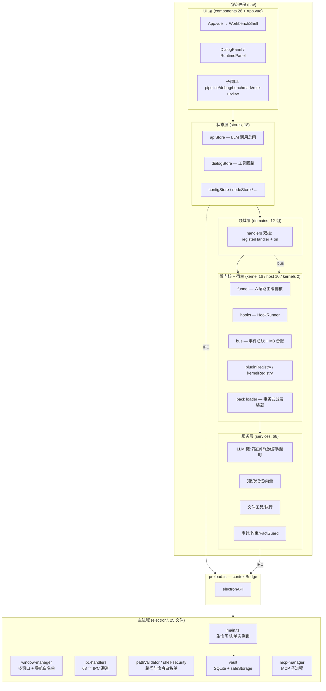
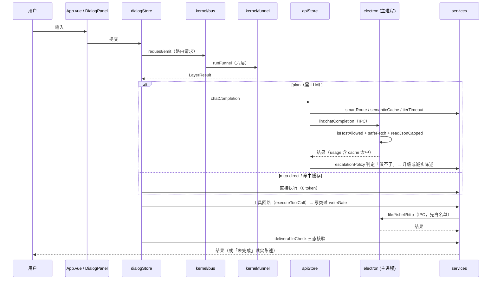

# HoloStarmap 架构与工程总结

> **代码基线**：`feat/model-collaboration` @ `292e95f`（2026-09-27 之后一轮修复）
> **撰写方式**：分区域只读调研（子代理并行 + 本机 grep/read 锚点复核）。凡标 `file:line` 者均为写入时实测位置；凡未经复核的推断已显式标注「待核验」。
> **与既有文档的关系**：本目录下另有 `ARCHITECTURE.md`（1091 行）与 `HOTPLUG-ARCHITECTURE.md`（1157 行），二者写于「星图时代」，仍列 `three` 依赖与 125 节点 3D 交互界面——**3D 星图 UI 已于 2026-09-26 整条删除**，故那两份文档在 UI/依赖部分已系统性过期。本文以**当前代码真值**为准重述架构，并保留对过期点的显式标注。
> **口径**：本项目文档的状态标记系统性滞后于代码（见 §15.1），故本文所有结构性断言优先取代码，文档仅作意图参考。

---

## 0. 全景

### 0.1 一句话

HoloStarmap 是一个**本地优先（local-first）的桌面 AI 工具控制台**：把「调用 LLM」工程化为一条由**微内核 + 事件总线 + 六层路由漏斗 + 多重缓存 + 双引擎安全审计 + 诚实性核验**组成的流水线，用 Electron 承载主进程安全边界与渲染进程 UI。

### 0.2 分层总图



### 0.3 规模一览（实测）

| 区域 | 文件数 | 说明 |
|---|---|---|
| `electron/` | 25 | 主进程 + preload + 类型声明 |
| `src/services/` | 68 | 业务逻辑主体 |
| `src/components/` | 28 | Vue 组件（含 `workbench/` 4、`RuleReview/` 9） |
| `src/domains/` | 24 | 12 组 × (`index.ts` + `handlers.ts`) |
| `src/stores/` | 18 | Pinia store |
| `src/kernel/` | 16 | 微内核原语 |
| `src/host/` | 10 | 插件/内核/领域包宿主 |
| `src/kernels/` | 2 | 默认内核插件 |
| `src/packs/` | 27（含 json） | 领域包：finance 5 / hr 3 / legal 19 |
| `src/data/` | 4 | topology / l2Manifests / mcpCatalog / skillCatalog |
| `src/exam/` + `src/benchmark/` | 3 + 3 | 验收考试 + 压测 |
| `electron/ipc-handlers.ts` | — | 实测量 `ipcMain.handle/on` **68 处** |
| `test/` | 169 spec | unit 145 / 根 17 / integration 3 / chaos 1 / e2e 3 |

---

## 1. 技术栈与工程配置

| 层 | 选型 | 存在的理由 |
|---|---|---|
| 桌面壳 | Electron 33.4.0 | 需要文件系统、多窗口、本地 HTTP、本地 SQLite——纯 Web 做不到 |
| UI | Vue 3 + Pinia | 响应式 + 组合式 API，便于把 3D/DAG 逻辑抽成 composable |
| 语言 | TypeScript `strict` | 见 §1.2 的禁令——用类型把「隐式 any / 断言逃逸」挡在编译期 |
| 构建 | electron-vite 5 | 主/预加载/渲染三段构建 + HMR |
| 测试 | vitest 3 | 见 §13 |
| 嵌入 | `@xenova/transformers`（MiniLM-L6-v2, 384 维） | **本地**向量检索，不出机器；离线降级伪向量 |
| 文档读写 | docx / mammoth / pdf-parse / xlsx | Office/PDF 的读写能力，且**不依赖本机装 Word** |
| 打包 | archiver / extract-zip | 备份包的打包与恢复 |
| 净化 | DOMPurify + marked | LLM 输出的 HTML/Markdown 渲染前净化 |
| 编码 | iconv-lite + jschardet | 中文文件的编码检测与转换（GBK/CP936） |
| 持久化 | better-sqlite3（WAL） | 见 §9 |

### 1.1 工程配置的几处「异常」，值得记录

1. **`dependencies`/`devDependencies` 里没有 `electron` 与 `electron-builder`**，但 `package.json` 有 electron-builder 的 `build` 段（`asar: false`、`win.target: portable`、`afterPack: ./build-after-pack.js`）。含义：构建依赖**全局安装**的 electron/electron-builder，`npm install` 后不能开箱即跑构建。（待核验：三处 worker 均报告此点，未在 package.json 层面复核为「刻意为之」还是「遗漏」。）
2. **`build-after-pack.js` 把整个 `node_modules` 复制进 `resources/app`**——与 `asar: false` + portable 配套，目的是保证 `better-sqlite3` 等 native 模块可加载。代价是产物体积大。
3. **验证脚本实际存在但分散**：`package.json` 有 `typecheck`（`tsc -b tsconfig.node.json --force && vue-tsc --noEmit`）、`test`（`vitest run`）、以及三条 e2e 脚本 `verify:pdf` / `verify:image` / `verify:media`（esbuild 打包后交 electron 运行）。而会话级配置 `.rivet-config.json` 里写的 typecheck 是 `tsc --noEmit`——**两者不一致**，后者会漏掉 `vue-tsc` 与 `--force`（省 `--force` 会因 TS6305 掩蔽真错，这一条已写入项目交接文档的「坑」清单）。
4. **`ARCHITECTURE.md` §2.2 称「没有独立的 typecheck/lint script」**——已过期，`typecheck` 现已在 `package.json` 中。
5. **无 lint/prettier 配置**：代码规范（禁 `any`/`as`、文件 kebab-case、composable `use` 前缀）靠 `CONTRIBUTING.md` + PR checklist 人工约束。

### 1.2 编码约束（CONTRIBUTING.md）

- `strict: true`；**禁止** `any`、`unknown`（除非显式允许）、`as` 断言、动态属性访问 `obj[dynamicKey]`
- 命名：文件 kebab-case、组件 PascalCase、composable `use` 前缀、store `useXxxStore`
- Vue 一律 `<script setup lang="ts">` + `defineProps<T>()` / `defineEmits<T>()`
- 提交走 Conventional Commits

> 备注：仓库内实际存在 `as unknown as` 之类的逃逸（如测试与少数适配层）。约束是**方向**，不是已被静态强制的规则——因为没有 lint 门。

---

## 2. 进程与窗口模型

### 2.1 进程划分

- **主进程**（`electron/`）：唯一有 Node/文件系统/子进程权限的地方。所有高危动作（文件读写、shell 执行、HTTP 出网、MCP 子进程、vault 读写）都在这里，且**每一类都先过白名单**（§10）。
- **preload**（`electron/preload.ts`）：`contextBridge` 暴露 `window.electronAPI`，是渲染层与主进程之间唯一的窄接口。
- **渲染进程**：Vue 应用，业务逻辑主体。

### 2.2 五个窗口

| HTML 入口 | 挂载点 | renderer 入口 | 窗口职责 |
|---|---|---|---|
| `index.html` | `#app` | `src/main.ts` → `App.vue` | 主窗口（工作台） |
| `pipeline.html` | `#pipeline-app` | `src/pipeline-main.ts` | 流水线工作台（DAG 画布） |
| `debug.html` | `#debug-app` | `src/debug-main.ts` | 调试监视器 |
| `benchmark.html` | `#benchmark-app` | `src/benchmark-main.ts` | Token 优化压测台 |
| `rule-review.html` | `#rule-review-app` | `src/rule-review-main.ts` | 规则审核台 |

五个入口在 `electron.vite.config.ts` 的 `renderer.build.rollupOptions.input` 中显式登记。

**设计要点**：四个子窗口共用同一套「pinia store 跨窗口同步」模式——`$subscribe` → `storeSyncToMain`，主窗口广播 → `onStoreApplyUpdate` → `$patch`。其中 `pipeline-main.ts` 直接同步，`debug` / `benchmark` / `rule-review` 三者在 `setTimeout(100)` 内做了节流缓冲（高频调试流量的取舍）。

### 2.3 生命周期与单实例（`electron/main.ts`）

- `app.whenReady()` **之前**调 `app.requestSingleInstanceLock()`：未持锁即 `app.quit()`，`whenReady` 内再兜底 `return`；持锁者注册 `second-instance` 事件聚焦主窗。
  - **存在目的**：此前只是「文档承诺」（`ARCHITECTURE.md:133` 写了单实例，代码从未实现），双实例会**并行写同一个 `vaults/default.db`**——这是数据损坏级风险，故列为 `E-8` 修复项。
- 窗口创建与销毁统一走 `window-manager.ts`，不在 `setupIpc` 时持有固定窗口引用。
  - **存在目的**（注释 `A-06/A-01`）：macOS `activate` 重建窗口后旧引用变野指针；窗口关闭后 `isDestroyed` 判不住。动态获取 + 内建存活校验是唯一稳的解。
- `window-manager.ts` 另有 `E-1` 导航白名单：`will-navigate` 只放行白名单目标，阻断渲染层被诱导跳转到外部页面。

---

## 3. 微内核 + 插件宿主 + 事件总线

### 3.1 这一层为什么存在

HoloStarmap 的目标不是「一个聊天应用」，而是「一个能被**第三方能力**持续扩展的工具操作系统」。为此它把「路由与执行策略」从业务代码里抽出来，做成可整体替换的**内核**：

- `src/kernel/` = 与业务无关的**原语**（漏斗骨架、钩子运行时、事件总线、竞争评分）；
- `src/host/` = **宿主**（注册表、生命周期、领域包装载、权限）；
- `src/kernels/` = **具体内核实现**（当前只有 `default`）。

三层职责的边界（依据各文件头注）：

| 模块 | 它**知道**什么 | 它**不知道**什么 |
|---|---|---|
| `kernel/funnel.ts` | 六层顺序、门值、两道门位置、降级 | 每层的具体实现（由内核插件注入） |
| `kernel/hooks.ts` | 注册表、快照、执行/合并/聚合、veto | 六层语义本身 |
| `kernel/bus.ts` | 通道、监听者、handler、台账、孤儿扫描 | 谁在用这些通道 |
| `host/*` | 插件/内核/领域包的生命周期与依赖 | 各插件的内部逻辑 |

### 3.2 `kernel/funnel.ts` — 六层路由编排核（M5）

**是什么**：一条六层嵌套路由的**编排器**。只持有 `LAYER_ORDER`、门值（`FunnelGates`）、钩子插桩点、降级、以及两道门的位置；每层的默认实现由内核插件注入，可被 override 钩子替换。

当前门值（`DEFAULT_FUNNEL_GATES`）：`l05Pass=0.6`、`l05Auto=0.9`、`l1Pass=0.6`。（`l05Pass` 于 2026-09-30 由 0.8 降到 0.6，见 §16.3。）

层产出（`LayerResult`）是一个判别联合：`plan`（带分值的计划，过门评估）/ `candidates`（多候选待仲裁）/ `intent-confirm` / `slot-fill` / `mcp-direct` / `miss`（降级到下一层）。

**存在目的**：把「便宜的先试、贵的后走」写成**可配置的结构**而非散落的 if——L0 规则 → L0.5 关键词 → L1 单节点 → L2 RaaP 混合检索 → L3 LLM 仲裁 → L4 探索兜底。领域钩子只能经 `advisory`（`scoreDelta`）影响打分，**不能直接改路由结果**——这是「内层优先」这一不变量得以维持的机制保障。

> ⚠️ 已知业务现实（`docs/最新口径.md` §三）：第八轮验收考试 18 题的 `routeKind` **全部落到 plan**——分层降本的设计意图在实测中未兑现，L1 层近乎死层。**结构存在 ≠ 收益已兑现**，这是当前最大的「架构叙事 vs 实测」落差。

### 3.3 `kernel/hooks.ts` — HookRunner

**是什么**：钩子注册表 + 快照 + 执行/合并/聚合 + veto 门。注册顺序 = 插件注册顺序（单调 `seq`）。

**存在目的**：让领域包/插件能**在不改内核代码**的前提下插入判定（尤其是 veto：一票否决）。权限校验由注册方在注册时复查（`hasPermission`）——运行时不再做权限判断，避免热路径开销。

**关键语义**：`runVetoGate` 区分 fail-open 与 strict fail-closed——即「钩子自己崩了算不算否决」由调用点显式选择，而非默认。

### 3.4 `kernel/bus.ts` — 事件总线（含 M3 卸载台账）

**是什么**：全局单例 `globalBus`，提供 `on/off/emit/registerHandler/request/requestAsync`，外加：
- **M3 卸载台账**（`BusLedger`）：任何注册即入账，卸载时核销；
- **命名空间总线**（`NamespacedBus`）：插件通道强制加 `plugin:<id>:` 前缀；
- **孤儿扫描**（`scanOrphanChannels`）：只**告警**，不自动删除——避免误杀尚在被使用的通道；
- `clear()` 仅在 `isTestEnvironment` 下允许。

**存在目的**：插件化最大的风险是**通道泄漏**（插件卸载后监听器还在，越积越多且语义错乱）。台账 + 命名空间 + 孤儿扫描是这一风险的三层防护。

**全项目最关键的约定（下文 §4 反复引用）**：

```
emit(channel)          → 只达 on(channel)         ；无监听者静默 return
request/requestAsync   → 只达 registerHandler()   ；无 handler 抛 "no handler registered for channel"
```

两条管道**互不相通**，挂错就「生产静默失联」。项目历史上出过这类事故（DAG 执行链曾因挂错路而静默失效）。

### 3.5 `kernel/competition.ts` — 竞争模型（M16）

**是什么**：纯逻辑的竞标与消解。竞标分 = 置信度 × `weight` × EMA 质量；消解按分降序 → weight → seq 兜底；**少于 2 个投标者返回 null**（不竞争）。EMA 更新 = `0.9×旧 + 0.1×outcome`，落 vault 的 `packStats` 命名空间。含**零副作用影子评估**（败者也评估，用于学习）。

**存在目的**：让多个领域包对同一诉求**竞争**，而不是靠硬编码优先级。影子评估是为了让败者也有质量信号，避免「只有胜者被评估」导致的信号偏置。

### 3.6 `host/kernelRegistry.ts` — 换内核状态机

**是什么**：内核生命周期状态机 `idle → active → draining → switching`，含在途请求跟踪、drain 超时取消、失败回滚旧内核、或落到 `kernel:fatal` 空缺态。

**存在目的**：「换内核 = 换整套钩子表」是危险操作（换的过程中在途请求怎么办？新内核 mount 失败怎么办？）。状态机把这三个问题显式化：切换期 `dispatch` 入队（上限 busy）而 `route` 直接返回 busy（**不排队**——因为路由是同步决策，排队会引入未定义语义）。

### 3.7 `host/pluginRegistry.ts` — 插件注册与卸载

- **M1 注册**：id/manifest 校验 → 依赖解析 → 环检测 → `mount` 带超时 → 失败**全量回滚** → 超时置 zombie；
- **M2 卸载**：有依赖者拒绝卸载 → `unmount` 容错 → 台账清理 → 孤儿扫描 → 出册；
- **M14 权限缓存**；`checkPermission` **永不抛**入主流程（权限查询失败不应炸掉业务）。

### 3.8 `host/pack/loader.ts` — 领域包事务式装载

**是什么**：按 `manifest → 兼容性 → knowledge → boundary → execution` 顺序分层装载，任一步失败**逆序回滚**（`fail()` 走 disposer 栈）。

**细节取舍**：`mount` 自检失败的单条约束**标记为 `draft` + warning**，不阻断整个包挂载——即「一条规则写错了不该让整个领域包不可用」。

内置包来源用 `import.meta.glob` 收集 `src/packs/*`。

**支持 M19 热重载**：完整 `unmount + mount`。

> ⚠️ 已知缺陷（K-2/K-4 相关，本轮之前已修）：`mountPack` 的 `mounted.has()` 与 `mounted.set()` 之间全是 `await`（TOCTOU），并发两次 mount 同一 pack 可双双通过检查；`reloadChain` 只串行化 `reloadPack`，`mountPack`/`unmountPack` 未入链。此项列在项目「下一步」清单中待修。

### 3.9 `host/packHookBridge.ts` — 领域包 veto 落地为内核钩子

**是什么**：把领域包声明的 veto 注册成**当前激活内核**的 `VetoHook`：`pack:mounted/unmounted` 时注册/注销，`kernel:activated/switched` 时**全量重放**。

**存在目的**：领域包的边界规则必须作用于**任意**内核实现，而钩子表是内核私有的。桥接层解决了这个「包 ↔ 内核」的耦合问题，且保证换内核后规则不丢（重放）。

**细节**：`check` 只读、不经 `runConstraints`（避免计数副作用），且 **fail-open**。

### 3.10 `kernels/default/plugin.ts` — 默认内核插件（灰度期）

**是什么**：`kernel-default`。`mount` 重建 `HookRunner` 并做 `requiredL1` 悬空审计；对外提供 `route`（注入 `createDefaultLayers` + `runFunnel`）、`getHooks`、`runPreOutputGate`。

**当前状态**：处于**灰度 shadow 对照期**——`route` 尚未接管 `dispatch` 主路径。

> ⚠️ 待核验：`kernel/index.ts` 的 `createKernel().dispatch`（内联的 cache→route→budget→security→LLM→fact 链路）与 `host/kernelRegistry` 的六层 funnel `route` 是**两条并存入口**，尚未合一（子代理判定 `confidence: medium`）。这是当前架构里最值得澄清的一处二元性。

### 3.11 `src/infrastructure/index.ts`

纯再导出的 barrel（`export { ... } from '@/services/...'`），**无自身逻辑**。命名暗示它是「基础设施层」，实际实现仍在 `services/`——**命名与职责存在偏差**，读代码时勿被目录名误导。

---

## 4. 领域层与事件总线约定

### 4.1 结构

`src/domains/` 共 12 组，每组 `index.ts` + `handlers.ts`：

| 组 | 职责 |
|---|---|
| `api` | LLM 调用的领域入口（含 `api:chat-completion`） |
| `node` | 节点/内核状态与 DAG 频道 |
| `knowledge` | 知识库域 |
| `debug` | 调试探针与日志 |
| 其余 | 按领域切分（memory / pipeline / skill / rule 等） |

### 4.2 两条管道 → **双挂模式**

因为 `emit` 只达 `on()`、`request` 只达 `registerHandler()`（§3.4），每个 domain 的 handler **普遍双挂**：同一个函数既 `registerHandler` 又 `on`，并在重挂载前调 `_disposeXxx?.()` 释放旧订阅。

**存在目的**：这是「同一条业务消息既可能被广播（emit）也可能被请求（request）」的现实妥协。**代价**是任何一处只挂了单边，就会出现「事件发了没人收」或「请求发了报 no handler」——且**静默**（`emit` 无监听者不报错）。项目历史上 DAG 执行链、状态栏计数、暂停入口都曾因此静默失效。

> 判据（写在这里供后续排查）：若某功能「界面元素在但永远不更新」，第一步查该频道是挂在 `on` 还是 `registerHandler`，以及生产者用的是 `emit` 还是 `request`。

### 4.3 与内核的连接

domain handler → `globalBus` → 内核（hook/route）→ services。领域层**不直接**调 services 的重活，而是经总线解耦。这使得「同一能力被不同内核实现调用」成为可能。

---

## 5. 服务层（68 文件，四族）

### 5.1 LLM 调用链（路由 / 降级 / 缓存 / 超时 / 错误）

| 模块 | 职责 | 存在目的（防住什么） |
|---|---|---|
| `providerChain.ts` | M20 provider 降级链：active → 其余 ollama 格式 provider → 隐式 Ollama 端点（按 baseUrl 去重）；降级目标做 TTL 探测缓存（成功 300s；失败 5s→10s→20s→40s→60s 递增退避） | 端点不可用时业务不中断；失败退避防止对已挂端点持续打点 |
| `smartRouter.ts` | 按输入长度/约束命中/DAG 步数/历史 token/预算选 `ModelTier`；`ZeroTokenLearner` 自适应阈值 | 「用对的模型」而非「一律用大模型」——成本的第一次分档 |
| `modelRoles.ts` | 按 `callerId`/`taskType` 判 `main`/`aux` 角色；`resolveDirectTarget` | 修复 `S-1`：原直连分支一律用 `activeProvider+activeModel`，导致 aux 角色与「大模型兜底」都打同一个模型——**兜底的大模型从未真正被调用** |
| `llmTimeouts.ts` | **全仓唯一的** LLM 超时阶梯定义点：按 `maxTokens` 分档（≤512→60s / ≤4096→150s / ≤8192→240s / else 300s），绝对上限 600s；显式禁止 import Pinia store / vault | 此前 5 处各自定义阶梯（15/45/75/120s），改一处漏四处；收敛到唯一定义点 |
| `escalationPolicy.ts` | 判定「我做不了」（`detectUnsolvable`）+ 升级目标解析 + 诚实陈述文案 | 用户需求原文：「小模型解决不了的问题必须诚实陈述」——不把小模型的失败包装成成功 |
| `semanticCache.ts` | 精确键 = `查询哈希 × domain × packId`（M10）；B-13 僵尸条目防护；B-14 按 tier 分层重算 | 跨域缓存污染会串味（A 域的答案被 B 域复用）；tier 分层避免低档答案污染高档 |
| `sseParser.ts` | SSE / NDJSON 解析；`StreamDelta.truncated` 标记流内错误与 EOF 截断（S-4） | 流被中途掐断时**不能当成功**——截断必须可见并透传到调用方 |
| `errorClassifier.ts` | 关键词快速分类（不耗 token）+ 仅 `unknown/file_format/logic` 才回退 aux LLM 分类 | 错误分类不该烧钱；只有真需要判断的才上 LLM |
| `embedder.ts` | 本地嵌入；首载 15s 超时 + 失败 5min 冷却 + 超时降级**伪向量**；`needsReembedding` | 原 Q1/Q2/Q14 卡死根因：transformers.js 首载无超时会**永久挂起**并被缓存，导致所有 RAG 路由卡死 |
| `tokenBudget.ts` / `tokenEstimate.ts` | 预算检查与 token 估算 | 超预算前拦截 |
| `fallbackAnswer.ts` / `promptTranslator.ts` / `ollamaProvider.ts` | 兜底答案 / 提示词翻译 / 本地 Ollama 客户端 | 各自对应一类「无外部依赖也要能跑」的降级 |

### 5.2 知识 / 记忆 / 向量

| 模块 | 职责 | 存在目的 |
|---|---|---|
| `knowledgeBase.ts` | 条目索引 + 分块 + 摄取（`ingestFile`/`ingestText`/`ingestPackText`）+ `hybridSearch`；`readEntriesStrict` 区分「真空」与「解析失败」；`withEntriesLock` 读-改-写互斥 | K-3：裸 `JSON.parse` + 空 catch 会把**索引损坏静默降级为 `[]`**，随后一次摄取就用 `[新条目]` 覆盖全库——单点解析故障放大为永久数据丢失 |
| `vectorStore.ts` | 向量落盘与读回；持久化 `vectorIsPseudo`（C-11）；`deleteChunksFile`（C-16） | 伪向量标记若不持久化，检索期每次都被重复嵌入、永不收敛 |
| `knowledgeMigration.ts` | partition 迁移（备份/对账/幂等） | 存量条目补 `partition` 字段，且必须**可回滚**（计数不符则恢复备份） |
| `convMemory.ts` | 会话轮次摄取 + 水位线 + 摘要 | 水位线若不持久化，**每次重启会把整段历史重新摄取一遍** |
| `sessionMemoryContext.ts` | 构造 `[会话记忆]` system 前缀，按 role+前 80 字去重（G-16） | 记忆注入主路径，且不重复注入 |
| `jsonSafe.ts` | `stripBom` / `parseJsonSafe`：失败返回 null 并打**可见**告警 | BOM 事故：带 BOM 的 JSON 会让解析静默失败 |

### 5.3 文件工具与执行

| 模块 | 职责 | 存在目的 |
|---|---|---|
| `macroExecutor.ts` | 宏/多步计划的执行器（含工具回路、步骤截断、DAG） | 把「多步任务」从模型自由发挥变成确定性执行 |
| `nativeTools.ts` | 常驻原生工具（`N1`）：不依赖 MCP 的读/列/写；`withAlwaysAvailableTools` 保证**不被检索过滤剔除** | 原实现下若 MCP 未连，模型手里连「读文件」都没有——整类能力消失 |
| `toolRegistry.ts` | 工具名与副作用分类的**唯一定义点**（`SIDE_EFFECT_TOOLS` 含 file_move/file_convert） | 两处名单漂移会导致「写类工具被当读类放过」 |
| `writeGate.ts` | 写类工具唯一裁决入口 `requestWriteApproval`，**fail-closed** 三态 | 写操作必须过人的确认；失败时拒绝而非放行 |
| `fileContext.ts` / `fileTaskSystemPrompt.ts` | 文件上下文组装 / 文件任务系统提示词 | 让模型知道「手上有哪些文件能力」 |
| `imageRenameByDate.ts` | `planImageRenames`（纯函数计划）+ `renameImagesByDate`（一次调用执行） | 弱模型做不了「逐文件决策」，把它收敛成确定性批量操作 |
| `l0SkillRouter.ts` | L0 规则路由 + L0.5 关键词快配 | 零 token 直达的第一层 |
| `deliverableCheck.ts` | 产物三态核验（存在性/非空/相关性），fail-open | **项目灵魂件**：宁可判自己失败也不假装成功 |
| `listingPick.ts` | 从目录列举结果里挑「最相关的文件」 | 目录列举信息量大，需要确定性挑选而非丢给模型 |

### 5.4 审计与约束

| 模块 | 职责 | 存在目的 |
|---|---|---|
| `dualEngineValidator.ts` | 规则引擎 + LLM 引擎双审；24h 缓存 | 「两个独立判据都过才放行」——fail-closed |
| `factGuard.ts` | 5 类实体（金额/日期/百分比/合同号/人名）一致性核验；小差自动纠正、大差拦截 | 幻觉的**实体级**拦截，比「整段重生成」便宜得多 |
| `constraintFeedback.ts` | 约束命中反馈 | 让用户/模型看见「哪条规则触发了」 |
| `ruleEngine.ts` / `ruleStore.ts` | 规则引擎与规则存储 | 规则可编辑（对应规则审核台） |
| `domainConstraints.ts` / `l1Capabilities.ts` | 领域约束与 L1 能力声明 | 与领域包边界层对接 |
| `terminologyMap.ts` | 术语映射 | 领域术语归一 |
| `resultBeautifier.ts` | 结果美化 | 输出可读性 |

> 注：`docs/最新口径.md` 对「学习族（EMA/指纹/ZOL/偏好）」与「审计族（双引擎）」的判定是**费效存疑/未证实**——存在不等于有收益。这是本项目的自我审计结论，本文如实转述。

---

## 6. 状态层（`src/stores/`，18 个 Pinia store）

| store | 管理什么 | 被谁驱动 |
|---|---|---|
| `apiStore` | **LLM 调用的总闸**：路由 → 超时 → 降级 → 兜底升级 → 缓存 → 记账 | 全应用（对话、宏、分类、判卷） |
| `dialogStore` | 对话消息、工具回路（`executeToolCall`）、`FIXED_SYSTEM_PROMPT` | DialogPanel |
| `configStore` | 视图模式、主题、provider 配置、偏好 | 设置页 / titlebar |
| `nodeStore` | 节点状态（L1/L2/L3、DAG 链、锚定） | 工作台 Nav / RuntimePanel |
| `knowledgeStore` | 知识条目与检索状态 | 知识库 UI |
| `memoryStore` | 会话记忆（`holo-session`，经 `vault.writeThrough`） | 对话回路 |
| `debugStore` | 调试探针日志与记账 | 调试窗口 |
| `sessionStore` / `pipelineStore` / `mcpStore` / `hotplugStore` / `soakStore` / `ruleStore` / `feedbackStore` / `notificationStore` / `onboardingManager` 等 | 各自领域状态 | 对应 UI |

**设计要点**：store 是**渲染层的唯一状态源**，跨窗口同步即通过 pinia `$subscribe` + IPC 广播（§2.2）。`apiStore` 是最大的耦合中心——它集中 import 了 §5.1 的整条 LLM 链（已在这两个文件里形成事实上的「LLM 子系统门面」）。

---

## 7. UI 层

### 7.1 主窗口结构（`src/App.vue`）

```
titlebar（品牌 + 调试探针/压测/规则审核入口 + 主题 + 通知 + 设置 + 窗口控制）
  └─ WorkbenchShell
        ├─ WorkbenchNav（左）
        ├─ DialogPanel（中，docked）
        ├─ RuntimePanel（右）
        └─ StatusBar（底）
  └─ 公共弹层：ApiSettings / Notification / NotificationCenter / CommandPalette
              / SettingsPage / OnboardingWizard / L0Modal
```

**视图模式**：`viewMode` 现只有 `workbench` 与 `preview` 两态（`configStore.setViewMode`）；`preview` 时叠加 `ResultPreviewStage`。

> **`App.vue:19` 原注释**：「125 节点 3D 星图视图已于 2026-09-26 删除，不再有模式开关」——这是「删星图」这一轮工作的落点。`configStore.ts:178-180` 仍保留旧持久化值 `'starmap' → 'workbench'` 的**归一化**（老用户配置迁移用），是**刻意保留**而非残留。

### 7.2 组件分组（28 个）

| 组 | 组件 |
|---|---|
| 壳层 | `workbench/WorkbenchShell`、`WorkbenchNav`、`RuntimePanel`、`StatusBar` |
| 对话 | `DialogPanel`、`ResultPreviewStage`、`CommandPalette`、`ZolWidget` |
| 窗口页 | `PipelinePage`、`DebugWindowPage`、`BenchmarkPage`、`ToolSelector` |
| 配置/通知 | `ApiSettings`、`SettingsPage`、`DataManagement`、`Notification`、`NotificationCenter` |
| 引导/领域包 | `OnboardingWizard`、`L0Modal` |
| 规则审核台 | `RuleReview/` 9 个（页面/列表/详情/编辑/图表/反馈/引用/状态/测试） |

### 7.3 `composables/`

- `useDagEngine.ts`：Canvas DAG 编辑引擎（`NODE_W/NODE_H/PORT_R/GRID_SIZE/LAYER_GAP_X/NODE_GAP_Y`），由 `PipelinePage` 消费。
- （`useThreeScene.ts` 随星图一并删除，`README.md`/`CONTRIBUTING.md` 中仍引用它——**文档过期点**。）

---

## 8. 数据与配置层（`src/data/`）

| 文件 | 内容 | 存在目的 |
|---|---|---|
| `topology.ts` | **125 节点体系**：`L0_NODE`(1) + `L1_TOOLS`(6，均 `locked:true`) + `L2_TEMPLATES`(20) + L3 社区节点(98，`goldenAngle` 球面分布) | 整个信息架构的**静态骨架**；L3 是社区工具的**预留位** |
| `l2Manifests.ts` | 20+ 个可执行 L2 宏清单（含 routing / execution.dagPlan / paramMapping） | 「工具即产品（RaaP）」的声明式落地 |
| `mcpCatalog.ts` | MCP 目录（5 项：filesystem / memory / sequential-thinking / github / context7） | 可安装的 MCP 服务清单 |
| `skillCatalog.ts` | 技能目录 | 技能市场清单 |

**L1 六节点**：知识库投喂员、模型网关、任务翻译官、流水线搭建台、工作区记忆体、结果美化师。

> **重要边界（用户明确）**：`topology.ts` 的 125 节点（含 98 个 L3 装饰占位）**保留**，L3 是用户自行填充的**预留位**；`docs` 下「清理 L3 装饰占位」的条目属**过期建议，勿照做**。本文档遵守该边界，仅描述不处置。

---

## 9. 持久化与 Vault

### 9.1 结构

- **主进程**：`electron/vault.ts` 落到本地 SQLite（`better-sqlite3`，WAL 模式），敏感值经 `safeStorage` 加密。
- **渲染层**：`src/vault/index.ts` 的 `VaultClient` 是**内存 cache + 排队写 + IPC 落盘**的代理：
  - `readCache`（同步，读内存）/ `writeThrough`（入队 + 缓存 + 调度 flush）/ `read` / `write`（立即）/ `list` / `delete`；
  - **按 key 合并写队列**（P1-29）：后写覆盖前写，杜绝旧值在 flush 时倒灌；
  - **同步屏障**（P0-7）：`syncFromVault` 时磁盘优先，防默认值覆盖磁盘数据；屏障前写入的 key 会丢弃其过期排队写；
  - **指数退避 flush**：100ms → 200ms → … → 5s 封顶；
  - `flushBeforeUnload` 在窗口卸载时尽力排空（A6-14）。

**存在目的**：渲染层不能直接写 SQLite，又不该每次写都同步 IPC 往返——「内存 cache + 合并队列 + 退避 flush」是在**性能**与**不丢数据**之间的取舍。代价是「写后立即崩」可能丢最后一批（已用 `beforeunload`/`pagehide` 兜底）。

### 9.2 命名空间

`knowledge` / `conv` / `skill` / `secure` / `api` / `packStats` / `backup-<ts>` 等。`backup-*` 由 `backupRestore.ts` 在迁移/备份时写入。

---

## 10. 安全模型

### 10.1 总原则：fail-closed

「安全判定给不出明确的『安全』，就拒绝」。全部高危动作收敛在主进程（§2.1），且**每一类都有白名单**。

### 10.2 主进程侧的四道闸

| 闸 | 文件 | 机制 |
|---|---|---|
| **路径** | `pathValidator.ts` | 读黑名单（P0-4：`.ssh`/`.aws`/`SAM`/`Credentials`…）+ 写黑名单（P0-6：startup/`.bashrc`/`System32`/`Program Files`…）+ `openPath` **白名单 fail-closed**（E-2）+ 危险扩展名（P1-3：`.py/.mjs/.lnk/.url`…）+ `realpathDeepest` 防符号链接逃逸（P1-8）+ 尾随点/空格与 NTFS ADS 冒号（P0-5/A-20） |
| **命令** | `shell-security.ts` | 白名单命令前缀 + 黑名单模式 + `node -e` 受信签名（`NODE_E_ALLOWED_WRITE_PATTERNS`）+ 元字符逐字符判定（`%` 与换行**任意位置**拒绝；`& \| < > ^` 仅**引号外**拒绝）+ 超时分级 + 写目标目录限制 |
| **出网** | `ipc-handlers.ts` 的 `safeFetch` | 私网/保留地址拒绝（IPv4+IPv6 全段）+ **DNS Rebinding 防护**（A-12：校验通过后把连接**固定到已校验 IP**，Host/SNI 仍用原域名）+ 响应体上限（`ipcBounds`）+ 超时覆盖到 body 读取（E-5） |
| **有界性** | `ipcBounds.ts` / `pathExpansion.ts` / `llmAbortRegistry.ts` | LLM JSON 体积上限、`readBodyCapped`、发送前判存活（`safeSendTo`）、路径模板展开（F-8）、LLM 请求取消注册表 |

**`pathValidator` 的对称性**：读路径与写路径校验**对称**（A-20）——否则可读允许目录内文件的 ADS 流（`file.txt:stream`）绕过扩展名管控。

### 10.3 `ipc-handlers.ts` 的结构（68 个通道）

一个巨型文件，按通道分组：窗口 / `safeStorage` / file / doc / image / media / store / mcp / shell / http / backup / watchfs / llm / knowledge / vault / data / vector。

**F-8 修复的落点值得记录**：四个路径校验入口（`validatePath`/`validateReadPath`/`validateWritePath`/`validateOpenPath`）在模块顶部被**包装**为「先展开 `%USERPROFILE%`/`%HOME%` 再校验」——一处覆盖全部调用方，且以后新增的 handler 自动获得展开。这正对治本项目历史上反复出现的「单侧修复」（改了一侧漏另一侧）。

### 10.4 渲染层侧的审计

`dualEngineValidator`（规则 + LLM 双审）+ `factGuard`（实体级幻觉拦截）+ `writeGate`（写类工具 fail-closed 三态确认条）。

> ⚠️ `docs/最新口径.md` 的判定：**风险确认条（O10）在原生 fast path 上曾是纸面空文**（`file_write` 不经 `requestRiskConfirm`），后已修；且双引擎审计存在**费效倒挂**（审核 `read_file` 花 5000 token，比动作本身贵一个数量级）。安全机制的「有效性」与「代价」是两件事，本文并陈。

---

## 11. Token 成本优化体系

这是项目的一等公民目标（README 声称基准测试 **39–49% token 下降**）。分层如下：

### 11.1 五级拦截漏斗（能不上 LLM 就不上）

```
输入 → [L0 规则] → [L0.5 关键词] → [L1 单节点直调] → [L2 RaaP 混合检索] → [L3 LLM 仲裁] → [L4 探索兜底]
          0 token      1 step          1 step            检索命中           短输出              全流程
```

- **L0**：内置硬规则零 token 直达；
- **L0.5**：关键词快配（门值 0.6 过门 / 0.9 自动执行，且自动执行还需「计划无 shell」；0.6 于 2026-09-30 由 0.8 降下）；
- **L1**：单节点能力直调；
- **L2**：manifest 混合检索（项目认定的**主力层**）；
- **L3**：小模型仲裁多候选；
- **L4**：确定性列目录三步计划（探索兜底）。

### 11.2 缓存族

| 缓存 | 键 | 目的 |
|---|---|---|
| 语义缓存 | `queryHash × domain × packId` | 同问秒回；domain/pack 隔离防跨域串味 |
| 执行指纹缓存 | 同输入 + 同 manifest 指纹 | auto-compile 晋级后复用结果 |
| 双引擎审计缓存 | 24h TTL，上限 500 条 | 重复审计不重复烧 token |
| 降级探测缓存 | provider TTL（成功 300s / 失败递增退避） | 不对已挂端点持续探测 |
| 消歧缓存 | 1h | 同查询不重复消歧 |

### 11.3 模型侧

- **tier 分档**：nano(512) / mini(1024) / standard(4096) / pro(8192)；
- **`ZOL` 零 token 学习**：三信号驱动阈值自调，反哺 `smartRoute`；
- **兜底升级**：小档拒答 → 升大档重试一次 → 仍失败则**诚实陈述**（§5.1 `escalationPolicy`）。

> ⚠️ 如实标注：`docs/最新口径.md` 判定学习族「**无实测收益指标**」，且 tier 切换曾只覆盖非流式 IPC 分支。**机制存在 ≠ 收益已兑现**——评估时应要求独立指标。

### 11.4 前缀缓存（用户已明确：**暂不做**）

基础设施已备（命中度量链路：`sseParser` / `streamUsage` / `debug` 域已透传真实值；已按缓存价分档计价；`FIXED_SYSTEM_PROMPT` 是模块级常量），但全仓 `cache_control` / `prompt_cache` / `context_caching` **零命中** ⇒ Anthropic 不会命中；OpenAI/DeepSeek 仅**被动受益**。用户裁定本轮不落地（见 `docs/2026.9.27.1-30快照.md` §五）。

---

## 12. 领域包（domain-pack）三层契约

### 12.1 契约

领域包（`src/packs/<domain>/`）是「一个行业的边界与能力」的封装，三层各司其职：

| 层 | 载体 | 作用 | 何时生效 |
|---|---|---|---|
| `knowledge/` | JSON 语料 → `ingestPackText` 入知识库，打 `partition='pack'` + `partitionId` | 行业语料供给 | 检索期（无 partition scope 的检索对其不可见 → **零污染**） |
| `boundary/` | `constraints.json` 规则集 + `evaluators/*.ts` 的 `check(ctx)` 判定函数 | 输出期拦截（含 veto） | 经 `packHookBridge` 注册进激活内核的钩子表 |
| `execution/` | `manifests.json`（L2 能力清单） | 路由目标 | 路由期 |

装载走 `loader.ts` 的事务式分层加载，失败逆序回滚；**单条约束自检失败只标 `draft`**，不阻整个包挂载。

### 12.2 现状

| 包 | 文件数 | pack.json | knowledge | boundary | execution |
|---|---|---|---|---|---|
| `finance` | 5 | ✅ | ❌ 缺 | ✅（5 条规则 + evaluators） | ✅（5 个 manifest） |
| `hr` | 3 | ✅ | ✅（HR 术语表） | ❌ 缺 | ✅ |
| `legal` | 19 | ✅ | ❌ 缺 | ✅（50 条规则 + 16 个 evaluators） | ✅ |

**三包各缺一层**，用户已裁定「缺失部分由用户手动撰写」，故这是**已知的进行中状态**，不是缺陷。

> 文件数口径说明：`src/packs/` 下 `.ts`+`.vue` 为 18 个，**含 `.json` 全部文件为 27 个**。两个口径都对，引用时需注明。

---

## 13. 测试与验收体系

### 13.1 三层测试

| 层 | 位置 | 数量 | 测什么 |
|---|---|---|---|
| 单元 | `test/unit/` | 145 | 服务/store/工具函数的边界与契约 |
| 根级 | `test/*.spec.ts` | 17 | 跨模块契约（含 `ipcSecurity` 直测主进程安全模块，靠 `@electron` 别名） |
| 集成 | `test/integration/` | 3 | 主路径端到端（如 `funnelMainPath`、`hotplugAcceptance`） |
| 混沌 | `test/chaos/` | 1 | 状态异常扰动 |
| e2e | `test/e2e/` | 3 | **被 vitest exclude**，走独立 `verify:*` 脚本 |

`vitest.config.ts`：`include: test/**/*.spec.ts`、`exclude: test/e2e/**`；coverage 仅统计 `src/services` 与 `src/stores`，阈值 lines/functions/statements 40%、branches 30%、**perFile**。

**当前基线**：全量 `npx vitest run` → **2384 passed / 2 failed**（2 例为在册的 `hotplugAcceptance` P3.6 环境超时，非回归）。

### 13.2 e2e 的独立入口

`package.json` 的 `verify:pdf` / `verify:image` / `verify:media`：用 `esbuild` 把 `test/e2e/*.e2e.ts` 打成 CJS，再交 `electron` 运行（`external` 掉 electron 与 native 模块）。**这三条是本项目唯一能验证 native 依赖（sharp / ffmpeg / PDF 渲染）的路径**。

> ⚠️ 技术债：`test/e2e/` 下另有 `launch.spec.ts`、`l0Skill.spec.ts`、`stress.spec.ts` 三个 spec——它们**既被 vitest exclude，又无任何 `verify:*` 脚本引用**，即当前**无运行入口**（孤儿测试）。这类测试会随时间腐坏而无人察觉。

### 13.3 验收考试系统（`src/exam/`）

| 文件 | 职责 |
|---|---|
| `examCases.ts` | 考题与硬断言定义（类别 doc/data/info/file） |
| `examRegistry.ts` | `examTraceId` 注册表（`isExamTraceId` 用于隔离判定） |
| `examRunner.ts` | 考试引擎：发题 → 监考聚合 → **judge + 硬断言双口径** |

**存在目的**：这是项目的**元工具**——`docs/最新口径.md` 的审计结论（机制可用性、边界真假、失分根因）全部由它产出。它做对的关键是：**traceId 全程可溯 + 学习隔离**（考试流量不进 ZOL 学习回路，否则会用考试数据污染生产路由）。

**已知的判据缺陷**：judge 与硬断言**双口径会不一致**（出现过 judge 判 deliverable 而硬断言判负），导致分数波动中混入噪声。

### 13.4 压测系统（`src/benchmark/`）

| 文件 | 职责 |
|---|---|
| `benchmarkRunner.ts` | 跑「基线 vs 优化路径」对比（L0/L0.5/L1/RaaP/指纹缓存五路） |
| `statsTracker.ts` | token/成本统计与 improvement 报告 |
| `testCases.ts` | 16 条标了期望路由的用例（A–E 组） |

---

## 14. 端到端数据流

### 14.1 主路径（一次用户请求）



### 14.2 关键不变量（跨层）

1. **渲染层不直连文件系统/子进程**——一律经 preload → IPC → 主进程白名单。
2. **emit 只达 `on`、request 只达 `registerHandler`**——挂错即静默失联。
3. **路径/命令/出网的判定点必须在「使用点」同源**——历史上多次出现「校验放行、运行时才拦」的不一致（如 D-1 的内网 baseUrl、F-8 的模板路径）。
4. **失败不得伪装成成功**——`deliverableCheck` + `escalationPolicy` 是这条不变量的两个执行者。

---

## 15. 设计取舍、已知风险与技术债

### 15.1 文档迟滞是本项目的**系统性**现象（不是偶发）

写作本文时实测到的过期/不一致：

| 位置 | 过期内容 | 真值 |
|---|---|---|
| `README.md` | 技术栈列 `three`；「125 节点 3D 星图」为主要卖点；结构图列 `useThreeScene.ts`、`components 14`、`services 13`、`stores 13` | three 已删；UI 已删；实际 components 28 / services 68 / stores 18 |
| `CONTRIBUTING.md` | 命名示例用 `StarMap.vue`、`useThreeScene.ts` | 已不存在 |
| `docs/ARCHITECTURE.md` | 大量星图时代内容；自述「没有独立 typecheck script」 | `package.json` 已有 `typecheck` |
| `.rivet-config.json` | typecheck 写 `tsc --noEmit` | 实际脚本是 `tsc -b tsconfig.node.json --force && vue-tsc --noEmit`（省 `--force` 会掩蔽 TS6305） |
| `docs/最新口径.md` | 2026-09-23 快照口径 | 文件顶部已自带 2026-09-27 复核注（F-6/F-7 已修） |

**结论**：本项目**必须**「先 grep 复核文档断言，再动手」——这条已写入项目约定。

### 15.2 代码层残留（已核实，非推测）

- **系统提示词仍自称「全息星图助手」**：`src/services/fileTaskSystemPrompt.ts:33`、`src/stores/dialogStore.ts:96`（`FIXED_SYSTEM_PROMPT`）。星图 UI 已删，此文案与现状语义不一致。（**仅记录，未修改**——属于产品文案决策。）
- `src/infrastructure/index.ts` 是纯 barrel，实现仍在 `services/`——**目录名与职责偏差**。
- `kernel/index.ts` 的 `createKernel().dispatch` 与 `host/kernelRegistry` 的六层 `route` 是**两条并存入口**（灰度期），尚未合一（**待核验**）。

### 15.3 已确证待修的真缺陷（项目「下一步」清单）

| # | 项 | 影响 |
|---|---|---|
| 1 | **H-9**：`host/pack/loader.ts` 的 `mountPack` TOCTOU（`has()` 与 `set()` 之间全是 `await`），且 `reloadChain` 只串行化 `reloadPack` | 并发 mount 同一 pack → 记录被覆盖/卸载泄漏 |
| 2 | **H-10**：`kernelRegistry` 的 zombie 内核**无生产清除通道**（唯一清除点 `destroy()` 的调用方为 0）；`pluginRegistry.withTimeout` 只 reject 外层、**不取消底层 mount** | mount 超时后内核 id 永久不可用，只能重启 |
| 3 | T-1 语义缓存键未含 `taskType`/`tier`（**取舍项**，需用户拍板） | 跨任务类型互相命中；换模型后旧答案续命 |
| 4 | `docs/最新口径.md` §二列出的两条**空缺边界**：数值计算、执行闭环 | 直接对应考纲失分题 |

### 15.4 本轮已修（同一分支）

| 提交 | 修复 |
|---|---|
| `133f34d` | **F-8** 主对话路径文件工具不展开 `%USERPROFILE%`/`%HOME%`（新叶子模块 `pathExpansion.ts`，四个校验入口统一前置展开） |
| `6aa0caa` | **D-1** 导入校验强化（私网 baseUrl 判定抽共享模块 `privateHost.ts` + 向量维度校验 + 不采信导入的 `vectorIsPseudo`） |
| `bf45470` | **T-2** `detectUnsolvable` 误报收窄（逐句 + 免责句排除）+ 横幅按实际角色选 + 流式补隔离守卫 |
| `292e95f` | **K-2/K-4** 会话水位线持久化 + 摄取去重下沉 + 迁移并入同一把锁 |

### 15.5 架构层面的核心张力（诚实记录）

1. **「机制存在」与「收益兑现」的差距**：学习族（EMA/指纹/ZOL/偏好）与审计族（双引擎）投入可观但**无独立效果指标**；六层漏斗在验收考试中 18 题全部落到 `plan`，分层价值未兑现。项目自己的审计文档已如实记录这一点。
2. **复杂度成本**：微内核 + 插件宿主 + 六层漏斗 + 事件总线 + 多层缓存，构成了一个**需要持续维护的复杂系统**；而其收益（token 下降 39–49%）主要在 README 声称的基准测试中，缺乏长期真实使用数据。
3. **文档与代码的同步成本**：本项目文档体量大（`docs/` 6700 行 + 根目录 1473 行），但状态标记系统性滞后——维护成本已经显性化为「每次开工必须先 grep 复核」。

---

## 16. 六层漏斗逐层内容、工具清单与实测可用性

> 本节为 2026-09-27 补录。第 3.2 节只写了「漏斗的结构」，本节补「每一层到底装了什么」，并对**工具能否真正使用**给出以实测为准的分级——凡标 ✅ 者均为本轮亲自跑出的证据，非文档转述。

### 16.1 层定义与实现落点

| 层 | 名称 | 门值 | 实现函数 | 内容服务 |
|---|---|---|---|---|
| L0 | 规则直通 | 无 | `l0()` | `l0SkillRouter.tryL0Skill`（10 条硬规则） |
| L0.5 | 关键词快配 | `l05Pass=0.6`（`l05Auto=0.9` 且计划无 shell） | `l05()` | `l0SkillRouter.tryL05QuickMatch`（比 L2 manifest 的 keywords） |
| L1 | 能力直调 | `l1Pass=0.6` | `l1()` | `l0SkillRouter.checkL1Capability`（4 项） |
| L2 | RaaP 混合检索 | — | `l2()` | `toolRetrieval.universalMatch` + M16 竞争 + 消歧四策略 |
| L3 | LLM 仲裁 | — | `l3()` | `toolRetrieval.llmFallback`（≥2 候选才上） |
| L4 | 探索兜底 | — | `l4()` | `l0SkillRouter.buildExplorePlan` |

编排核在 `src\kernel\funnel.ts`（`LAYER_ORDER` @ `:97`）；**每层默认实现在** `src\kernels\default\index.ts` 的 `createDefaultLayers()`；L0/L0.5/L1/L4 的具体内容在 `src\services\l0SkillRouter.ts`。

### 16.2 L0 — 11 条硬编码规则（零 token 直达）

每条规则 = 触发表 + **禁词表** + `buildPlan`；命中即跳过全部后续层。

| # | 规则（域） | 触发要点 | 产出工具 |
|---|---|---|---|
| 1 | 文件格式转换（file） | 「转/导出/另存为」+ 目标格式 | 见下方转换矩阵 |
| 2 | 快速 Shell 命令（system） | 以 `ls\|dir\|pwd\|whoami\|date\|cat\|type\|echo\|mkdir\|cp\|copy` 开头；「运行/执行」；`npm\|node\|pip\|python\|git` 开头 | `shell_exec` |
| 3 | 简单文本生成（creation） | 「写/生成/起草」+ 代码/函数/脚本/邮件/通知/公告/文案/总结 | `llm_generate` |
| 4 | HTTP 请求（network） | `curl\|fetch\|get\|post\|请求\|访问\|下载` 开头，或输入含 URL | `http_request` |
| 5 | 文件创建（file） | 「创建/新建/写/生成/保存」+ docx/word/txt/文档/文件 | `create_docx` / `file_write` |
| 6 | 创建文件夹（file） | 「创建/新建/建」+ 文件夹/目录/folder | `create_directory` |
| 7 | 简单查询（query） | 几点/什么时间/今天几号/天气/计算/算一下/等于多少 | `llm_generate`（`modelTier: nano`） |
| 8 | 快速文件操作（file） | 「读取/查看/打开/显示/阅读」或 `cat\|type\|head\|tail` | `read_file` |
| 9 | **图片按拍摄日期重命名**（file） | 「重命名/改名/更名/批量命名」+ 图片/照片/图像 | `rename_images_by_date` |
| 10 | **文件移动重命名**（file，2026-09-30 加） | 「移动/移到/挪到」或「重命名/改名/更名」+ 能同时抽出的真实 from/to 路径 | `file_move` |
| 11 | **文件复制**（file，2026-09-30 加） | 「复制/拷贝/copy」+ 能同时抽出的真实 from/to 路径 | `file_copy` |

**规则 1 的转换矩阵（2026-09-30 重写）**：

| 目标 | 源 | 实现 |
|---|---|---|
| `pdf` | docx / md / markdown / html / htm / txt | `file_convert`（应用内 mammoth + printToPDF） |
| `docx` | 文本源（txt/md/html/csv/json） | `read_file` → `create_docx` |
| `docx` | 二进制源（pdf/docx/xlsx/xls） | `doc_extract` → `create_docx` |
| `txt` / `md` / `csv` | 文本源 | `read_file` → `file_write` |
| `txt` / `md` / `csv` | 二进制源（pdf/docx/xlsx/xls） | `doc_extract` → `file_write` |
| `xlsx` / `json` / `html` | — | **如实说明无直接实现**（不产写盘步骤） |

> **2026-09-30 重写说明**：此前的「其他格式」分支走 `read_file` + `llm_generate`——**只产出模型文本、不落盘**，是"假转换"（用户要「转成 xlsx」只拿到一段文字）。重写后：有真实现的组合走「取文本 → 写盘」两步（二进制源先经 `doc_extract` 真提取），无真实现的组合如实说明。`→docx` 也从 `shell_exec` + `node -e` 拼 docx 脚本改成了框架内两步（甩掉 `npm install docx` 依赖与历史多次被安全闸拒的脚本形态）。

**禁词表是这层的核心防线**（在 `skillRules[*].forbiddenPatterns`）——例如「文件创建」禁入 `列出\|清单\|有哪些\|查看\|找出\|转成\|转为`（防「列清单」被误判成「建文件」，即验收 Q14 那次误路由）；「图片重命名」禁入 `审查\|合规\|条款\|转换\|导出\|保存为`；「简单查询」禁入 `分析\|报告\|审查\|对比\|文档\|文件\|转换`；规则 10 禁入图片类词（与规则 9 划清）与域词（审查/合同/报告…，避免抢 L2 manifest）。

**三处「不伪造」的取舍已写进代码注释**：规则 1、9、10 在**抽不到真实路径**时，不再生成假计划（规则 1 曾伪造 `input.<ext>` 占位符，导致计划跑到 step2 报「文件不存在（路径：input.9）」）——规则 1/9 产出一步「如实索要完整路径」的 `llm_generate`，规则 10 直接返回 `null` 下沉（它没有更合适的兜底形态）。

> **文档滞后点**：`README.md` 与 `docs\最新口径.md` 均称 L0 有 **8 条**规则——现为 **11 条**（第 9 条「图片按拍摄日期重命名」、第 10 条「文件移动重命名」、第 11 条「文件复制」均为后加）。`README.md:118` 另称「7 built-in patterns」，同属滞后。
>
> **2026-09-30 修正（规则 2）**：触发词移除了 `mv\|move\|rm\|del`——shell 白名单（`electron\shell-security.ts:4-16` 定义；`isShellCommandAllowed` 在 `:436-444` 按**词边界前缀**匹配 `trimmed === base \|\| trimmed.startsWith(base + ' ')`）不含这些命令，命中只会产出**必被拒绝**的计划（`命令不在白名单中`，exit -1）。「移动/重命名」改由规则 10 走 `file_move`（IPC 直连 fs，绕开 shell 白名单）；删除类**不设直达**，与 `writeGate` 的写授权边界取向一致。
> 同源未修（超出本次范围）：规则 2 的 `^(npm|node|pip|python|git)\s+` 里 `node`/`python`/`git` 同样不在白名单（`npm install`/`pip install` 才在）。

### 16.3 L0.5 — 单步 L2 工具的「快配」

`tryL05QuickMatch(input, allL2Manifests)`：拿输入逐字比对**所有 L2 manifest 的 `routing.keywords`**，按「命中率」排序；要求命中率 ≥0.4 且与第二名 margin ≥0.1；**本函数只做这道基本过滤**，是否放行由 funnel 的 `l05Pass` gate 决定（`DEFAULT_FUNNEL_GATES`，默认 **0.6**）；且**只接受单步形态**（`mode === 'direct'`，或 `dagPlan` 仅 1 步）——多步一律下沉 L2。命中后产出的是 `llm_generate` 单步计划。

即 L0.5 的覆盖面 = L2 清单中 **6 个 `direct` 型工具**：文档翻译英文版、公告通知草稿、客户邮件撰写、PPT 大纲生成、政策文档问答、ND 审查清单。（`macro` 型若 `dagPlan` 仅 1 步也参与。）

> **2026-09-30 修正（两处）**：
> ① **移除内层硬门 `confidence >= 0.8`**——它把过门线钉死在 `hitRatio ≥ 0.533`，实测对典型输入只有 **~8% 命中**（近死层）；且**遮蔽了 `l05Pass` 的配置面**：该 gate 只能"抬高"门槛，经 vault `config/holo-funnel-gates` 调低**永不生效**（低于 0.8 的候选在 `tryL05QuickMatch` 内就已 `return null`）。
> ② **`l05Pass` 默认 `0.8 → 0.6`**（与内层基本过滤下限 `hitRatio 0.4` 对齐，也与 `l1Pass` 同档）。`l05Auto`（自动执行门）保持 0.9 不变——降门只放宽"进入快配"，高置信才自动执行。
> 效果：同一批针对性输入从 **6 中 1 → 6 中 6**。此前该函数在测试里**全被 `vi.mock` 掉、零真实覆盖**，现由 `test/unit/l05QuickMatch.spec.ts` 钉住机制。
>
> **门值校准（2026-09-30 实测，回应 G-15「门值未经校准」）**：用 24 条标注输入（10 条正样本 + 14 条负样本，其中 6 条为"含 manifest 关键词但形态不同"的对抗样本：竞品分析/合同风险/邮件分类/财报总结/会议纪要 均属 macro|chain，及一条两个单步 manifest 混搭）扫门值，实测：
> | 门值 | 放行 | 正确 | 错配 | 负样本误报 |
> |---|---|---|---|---|
> | ≤ 0.60 | 7/24 | 7/10 | **0** | **0/14** |
> | ≥ 0.65 | 1/24 | 1/10 | 0 | 0/14 |
> | 0.90 | 0/24 | — | — | — |
> `confidence` 是**离散值**（`min(hitRatio × 1.5, 1.0)`，hitRatio 为分数），最小非零档即 0.6，故 0.6↔0.65 之间是断崖。**0.60 是本样本集下"放行全部通过基本过滤的候选"的下界且零误配**；旧门 0.8 恰落在断崖之上（放行 1/24）。校准基线已固化为测试（`l05QuickMatch.spec.ts` 的「门值校准基线」describe），门值或公式若改动引入误配会变红。
> **仍未校准**：`l05Auto`（0.9，自动执行门——风险门，本轮未测）、`l1Pass`（0.6）、`margin`（0.1）、内层 `hitRatio` 下限（0.4，与 `l05Pass` 重合：0.4×1.5=0.6，故 `l05Pass` 仅在调高时额外生效）。

### 16.4 L1 — 9 个路由出口（`checkL1Capability`）

| 能力 | nodeId | 判定方式 | 产出工具 |
|---|---|---|---|
| 文档 → PDF | `l1-doc-convert` | **确定性直调**（须输入含明确路径），不打分 | `file_convert` |
| 图片处理（缩放/转格式/压缩/灰度） | `l1-image-ops` | **确定性直调**（须「提到图片」+「抽得出操作参数」两个条件同时成立） | `image_process` |
| 音视频处理（转码/压缩/裁剪/出缩略图） | `l1-media-ops` | **确定性直调**（须「提到音视频」+「抽得出操作参数」两个条件同时成立） | `media_process` |
| 模型网关（翻译/润色/总结/改写…） | `l1-model-gateway` | 关键词打分 ≥0.6 | `llm_generate` |
| 知识检索（查知识库/检索…） | `l1-knowledge-feeder` | 关键词打分 ≥0.6 | `llm_generate` |
| 任务翻译官（拆解/执行步骤…） | `l1-task-translator` | 关键词打分 ≥0.6 | `l1-task-translator`（经 macroExecutor 分派到 handler） |
| 结果美化师（排版/美化/渲染…） | `l1-result-beautifier` | 关键词打分 ≥0.6 | `l1-result-beautifier`（同上） |
| 工作区记忆体（还记得/之前聊过…） | `l1-workspace-memory` | 关键词打分 ≥0.6 | `l1-workspace-memory`（同上） |
| 流水线搭建台（编排/流水线…） | `l1-pipeline-builder` | 关键词打分 ≥0.6 | `l1-pipeline-builder`（同上） |

**注意**：L1 覆盖 L1 六节点**全部六个**（模型网关、知识检索、任务翻译官、结果美化师、工作区记忆体、流水线搭建台），另加三个后补的确定性能力节点（doc-convert / image-ops / media-ops）。

> **2026-09-30 二次修正（关键词表缩表）+ 门值校准**：`conf = min(命中数 / **表长** × 2, 0.9)` 的**分母就是关键词表长度**——表越长越难命中。实测 `l1-model-gateway` 原 8 词表（翻译/生成文本/写一段/帮我写/改写/润色/总结一下/概括）**单次命中只有 0.25**，「帮我翻译一下这段话」这种最普通的请求都过不了 0.6 门；`l1-knowledge-feeder` 原 5 词表单命中 0.4 同样过不了。**缩表**：model-gateway → `['翻译','润色','总结']`、knowledge-feeder → `['检索','知识库','查一下']`（3 词表下单命中即 0.667 ≥ 门）。被去掉的多是宽词（"帮我写""写一段"），它们本就该走 L0 规则 3 或 L2。
> **`l1Pass = 0.6` 校准**：标注集（6 个关键词型节点各 1-2 条自然语言输入 + 5 条负样本）实测**全部落到正确节点、负样本零误接**。校准基线固化为 `l1Routing.spec.ts` 的「L1 门值校准基线」describe。
> **`l05Auto`（0.9）校准观察**：L0.5 命中样本中**无 conf ≥ 0.9**（该档需命中六成关键词，自然语言罕见）⇒ 自动执行门**几乎不触发**。这是**保守取舍而非缺陷**——不触发不造成功能损失（命中后仍需用户确认），故保持 0.9。记录在 `l05QuickMatch.spec.ts`。

> **2026-09-30 补 `l1-media-ops`**：它此前**登记在 `l1Capabilities.ts` 的权威能力表、且被 `l2-media-process-v1` 引用为 `requiredL1`，却没有任何路由出口**——与同族的 `doc-convert`/`image-ops` 不一致（那两个都有出口）。本次按 `image-ops` 同款口径补上：`extractMediaOp` 抽 `format/crf/start/duration/thumbnailAt/width`，`checkL1Capability` 在「提到音视频 + 抽得到参数 + 有明确路径」三条同时成立时直调 `media_process`；缺任一条即下沉（L2 的 `l2-media-process-v1` manifest 仍是它的归宿）。测试见 `test/unit/mediaRouting.spec.ts`。

> **2026-09-30 补齐**：此前 L1 只覆盖六节点中的**两个**，是 `最新口径.md` 判定「L1 近乎死层」的代码依据。本次补齐了 task-translator / result-beautifier / workspace-memory / pipeline-builder 四条路由规则（`l0SkillRouter.ts` 的 `l1Rules`）——四个节点此前在**执行侧有 handler**（`pipelineExecutor.ts:159-162`）而**路由侧无入口**，属「半接」。关键词表刻意保持 2-3 词短表：confidence 公式 `min(matchedKw / keywords.length × 2, 0.9)` 下，长表会让单次命中低于 0.6 门而永不触发。测试见 `test/unit/l1Routing.spec.ts`。详见 `docs/漏斗前四层盘点与L1补齐.md`。

> **2026-09-30 深化（接执行侧能力）**：四节点的计划步骤不再统一挂 `llm_generate`，而是直接挂各自的 `l1-*` 工具名；`macroExecutor.callToolDirectWithTier` 新增 L1 分派——`getHandler(name)` 取 `pipelineExecutor` 注册表里的 handler，构造 `NodeHandlerContext`（gateway 经 `llm:get-gateway`、memory/knowledge adapter）后真实执行，输出按 `response` 字符串 → 单 key → JSON 归一化（与 `pipelineExecutor` 的收口同口径）。四个 `l1-*` 已登记进 `toolRegistry.NATIVE_TOOL_NAMES`，保证 `confirmPlan` 的 `isAllNative` 快路径认得它们（否则计划落模型循环）。测试见 `test/unit/l1HandlerDispatch.spec.ts`。

### 16.5 L2 — RaaP 混合检索

`buildToolIndex(mcpTools + allL2Manifests)` → `universalMatch`；反馈类输入（`没有\|找不到\|不对…`）直接跳过。三岔：命中 **MCP** → 歧义给候选 / 唯一则 `mcp-direct`；命中 **L2 manifest** → 非歧义走 `finalizeRaapPlan`，黄门歧义先试 M16 跨 pack 竞争（`competitiveMode` 开启时），否则走消歧四策略（展示候选 / 翻译确认 / 槽位填充 / 降级 L3）。

L2 覆盖率 = **27 个 manifest**（`src\data\l2Manifests.ts`：**macro 20 / direct 6 / chain 1**）。名称清单：音视频处理、图片批量处理、文档转 PDF、合同风险审查、周报自动草稿、文档翻译英文版、财报风险一句话解读、竞品分析报告、公告通知草稿、报销单合规检查、条款对比助手、简历初筛助手、入职引导生成器、销售提案草稿、客户邮件撰写、会议纪要生成、PPT 大纲生成、Excel 数据摘要、政策文档问答、邮件自动分类、预算预测助手、ND 审查清单、KPI 报告生成、文件解读助手、文件创建器、考勤异常说明生成、离职交接清单生成。

> **文档滞后点**：`README.md` / `最新口径.md` 称 L2 有 **20 个**工具——实为 **27 个**；`src\data\topology.ts` 的星图节点模板仍是 20 条，**与 `l2Manifests.ts` 不同步**。

### 16.6 工具清单

**原生常驻工具 11 个**（`src\services\nativeTools.ts`，声明「不得被检索过滤剔除」，保证 MCP 未连时仍可用）：
`read_file`、`list_directory`、`file_write`、`file_move`、**`file_copy`（2026-09-30 加）**、`rename_images_by_date`、`create_docx`、`file_convert`、`image_process`、`media_process`、**`doc_extract`（2026-09-30 加，按路径提取 pdf/docx/xlsx/xls 文本）**。

**另有**：`shell_exec`、`http_request`、`llm_generate`、`knowledge_search`、`create_directory`（`nativeTools` 未登记但 L0 规则 6 在用）、以及 **MCP 工具**（目录 5 项：filesystem / memory / sequential-thinking / github / context7）。

**主进程侧通道**（`electron\ipc-handlers.ts`，均实测存在）：`file:write`、`file:move`、**`file:copy`（2026-09-30 加）**、`file:createDirectory`、`file:createDocx`、`file:list`、`doc:extractText`、**`doc:extractFromPath`（2026-09-30 加）**、`doc:convertToPdf`、`image:process`、`media:process`、`file:read`、`http:fetch`。

### 16.7 实测可用性（2026-09-27 本机亲跑）

**证据分三类**：
- **E2E**：`npm run verify:*` 三条脚本，真起 Electron 跑**生产代码**（不是复刻实现）
- **EXAM**：`exam-report.json`（ACCEPTANCE-SPEC v1.0，18 题）——**18/18 deliverable、零干预 13/18、平均 9.6s、59439 tokens**
- **CDP**：连 Electron 渲染进程（`connect_url` + 9222）直接调 `window.electronAPI.*`

| 工具 | 单测 | 端到端证据 | 判定 |
|---|---|---|---|
| `file_convert`（文档→PDF） | `l0ConvertSkillPath.spec` | **E2E `verify:pdf` PASS**：docx→pdf 31069B、md→pdf 23818B、负例（不支持格式）抛错且无产物；**EXAM** Q3/Q18 通过 | ✅ **可用（已实测）** |
| `image_process` | `imageRouting.spec` | **E2E `verify:image` PASS**：4/4 缩放转 webp、压缩体积变小、部分失败如实回传、负例拒 heic | ✅ **可用（已实测）** |
| `media_process` | — | **E2E `verify:media` PASS**：ffmpeg 61MB 就绪、转 webm、抽 mp3、出缩略图、CRF 压缩且探到源信息、裁剪、负例拒 docx | ✅ **可用（已实测）** |
| `file_write` | `dualEngineValidator.spec`（审计分类） | **CDP 实测** success + 读回内容一致（"hello-holo"） | ✅ **可用（已实测）** |
| `file_read` | `fileListing.spec`、`stepTopFiles.spec` | **CDP 实测** success + 内容一致；**EXAM** 多题数据类 | ✅ **可用（已实测）** |
| `file_move` | `fileMoveDispatch.spec` | **CDP 实测** from→to success，且随后的 `fileList` 反映新状态 | ✅ **可用（已实测）** |
| `create_directory` | — | **CDP 实测** success | ✅ **可用（已实测）** |
| `create_docx` | `createDocxTool.spec` | **CDP 实测** success，且产物被 `fileRead` 识别为 **isBinary、8523B**（真 docx = ZIP 二进制） | ✅ **可用（已实测）** |
| `list_directory` | `fileListing.spec`、`pickTopFileFromListing.spec` | **EXAM** Q14 真实列出桌面 7 个 .docx；**CDP** 实测 success | ✅ **可用（已实测）** |
| `rename_images_by_date` | `imageRenameByDate.spec` | **EXAM** Q15 通过（曾长期失败的题） | ✅ **可用（已实测）** |
| `http_request` | `dualEngineValidator.spec`（审计分类） | **CDP 实测** `httpbin.org/get` → 200 + 正常响应体 | ✅ **可用（已实测）** |
| `shell_exec` | `shellSecurity` 系列（白名单/元字符） | **CDP 实测** `echo` → code 0 + 正确 stdout；`rm -rf /` → **被白名单拒绝**；`whoami` → **同样被拒** | ✅ **可用（已实测），但白名单很窄** |
| MCP 工具（filesystem 等） | `mcpStore.spec` | **EXAM** Q16（route=`mcp-direct`）通过 | ✅ **可用（已实测）** |
| `knowledge_search` | — | 未走通端到端（EXAM 无直接题；L2 manifest 里作步骤出现但未单独验证） | ⚠️ **未实测** |
| `llm_generate` | 多处 | **EXAM** Q1/Q2/Q4/Q5/Q10/Q12/Q13 等大量通过 | ✅ **可用（已实测）** |

**结论**：**原生 9 个工具全部 100% 走通端到端**（其中 3 个有独立 E2E 脚本背书，6 个由 CDP 直调实测，另有 EXAM 交叉印证）；`http_request` / `shell_exec` 亦实测可用。**唯一未实测的是 `knowledge_search`**（无独立端到端入口）。

**两个必须一并说明的限定**：
1. **`shell_exec` 的白名单很窄**——`whoami` 这种常见命令都被拒。这意味着「让模型用 shell 解决问题」的实际可用面远小于工具表的观感；验收考中 Q6 报销加法与 Q17 长乘法都是**模型自己算**（未走 shell），这既是白名单窄的结果，也是数值边界空缺的证据。
2. **e2e 是手动脚本，不进 CI**——`verify:*` 需人手动跑（`test/e2e/**` 被 vitest 排除）。本节的三条 PASS 是本轮手动跑出的；若无人在提交前跑，native 链路回归不会被自动发现。此外 `test/e2e/` 下另有 3 个 spec（`launch`/`l0Skill`/`stress`）**既被 vitest 排除、又无 `verify:*` 引用**，属无运行入口的孤儿测试。

---

## 17. 附录：源码地图

```
HoloStarmap/
├── electron/                     # 主进程（25 .ts）
│   ├── main.ts                   # 生命周期、单实例锁(E-8)、vault 初始化
│   ├── window-manager.ts         # 多窗口 + 导航白名单(E-1) + 存活校验(A-01)
│   ├── ipc-handlers.ts           # 68 个 IPC 通道；路径/命令/出网白名单接线
│   ├── pathValidator.ts          # 读/写黑名单 + openPath 白名单(E-2) + realpath 防逃逸
│   ├── shell-security.ts         # 命令白名单 + 元字符逐字符判定 + 受信 node -e 签名
│   ├── pathExpansion.ts          # 路径模板展开（F-8 新增叶子模块）
│   ├── ipcBounds.ts              # 读取/发送有界性（E-5/E-6/E-7）
│   ├── llmAbortRegistry.ts       # LLM 请求取消注册表
│   ├── vault.ts                  # SQLite + safeStorage
│   ├── mcp-manager.ts            # MCP 子进程
│   ├── apiConfigStore.ts         # api-config 统一读取（vault 优先，文件回退）
│   ├── backupRestore.ts / fileListing.ts / docConvert.ts / docExtract.ts
│   ├── pdfRenderer.ts / imageOps.ts / mediaOps.ts / streamUsage.ts / shellOutput.ts
│   ├── preload.ts                # contextBridge electronAPI
│   └── types.d.ts                # 环境声明（非运行时）
├── src/
│   ├── kernel/                   # 微内核原语（16）
│   │   ├── funnel.ts             # 六层路由编排核（LAYER_ORDER / FunnelGates）
│   │   ├── hooks.ts              # HookRunner（注册表/快照/veto 门）
│   │   ├── bus.ts                # 事件总线 + M3 台账 + 命名空间 + 孤儿扫描
│   │   ├── competition.ts        # 竞争 EMA（纯逻辑 + 影子评估）
│   │   ├── clusters/budget.ts    # 预算集群
│   │   └── index.ts              # createKernel（灰度期 dispatch）
│   ├── host/                     # 宿主（10）
│   │   ├── kernelRegistry.ts     # 内核状态机（含 zombie）
│   │   ├── pluginRegistry.ts     # 插件注册/卸载/权限（M1/M2/M14）
│   │   ├── pack/loader.ts        # 领域包事务式分层装载（M19 热重载）
│   │   ├── packHookBridge.ts     # 包 veto → 内核钩子
│   │   └── types.ts              # LayerId 等宿主类型
│   ├── kernels/default/          # 默认内核插件（灰度 shadow）
│   ├── domains/                  # 12 组 × (index + handlers)，双挂 + disposer
│   ├── stores/                   # 18 个 Pinia store
│   ├── services/                 # 68 个业务模块（§5 分四族）
│   ├── components/               # 28 个 Vue 组件
│   ├── composables/useDagEngine.ts
│   ├── data/                     # topology / l2Manifests / mcpCatalog / skillCatalog
│   ├── packs/                    # 领域包（finance / hr / legal，三层契约）
│   ├── exam/                     # 验收考试（元工具）
│   ├── benchmark/                # 压测
│   ├── vault/index.ts            # 渲染层 VaultClient
│   ├── App.vue                   # 主窗口（workbench / preview 两态）
│   └── *-main.ts                 # 5 个窗口的 renderer 入口
├── docs/                         # 本项目文档（含本文）
├── test/                         # 169 spec：unit 145 / 根 17 / integration 3 / chaos 1 / e2e 3
├── config/l2_manifests/          # L2 manifest JSON
├── electron.vite.config.ts       # 三段构建 + 5 renderer 入口
├── vitest.config.ts              # include/exclude + coverage 阈值
└── build-after-pack.js           # 打包后复制 node_modules（配合 asar:false）
```

---

## 附：本文的证据强度声明

- **已核验（本机 grep/read 复核）**：六层漏斗结构、星图残留两处、`vitest.config.ts` 排除规则、IPC 通道数、各目录文件数、`package.json`/`tsconfig.node.json` 内容、L0 规则与 L1 四项能力的读码、L2 的 27 个 manifest 清单。（2026-09-30 补第 10 条 L0 规则后，L0 口径为 10 条。）
- **本轮真机实测（2026-09-27，§16.7 的依据）**：`npm run verify:pdf` / `verify:image` / `verify:media` **三条 E2E 全部 PASS**（真起 Electron 跑生产代码）；CDP 连 Electron 渲染进程直调 `window.electronAPI` —— `createDirectory`/`fileWrite`/`fileRead`/`createDocx`/`fileMove`/`fileList`/`httpFetch`/`shellExec` **全部实测通过**（含 `rm -rf /` 被白名单拒绝的负例）；`exam-report.json`（ACCEPTANCE-SPEC v1.0）实测 **18/18 deliverable**、零干预 13/18、平均 9634ms、59439 tokens。
- **来自子代理只读调研（未逐条回机复核）**：§3 各模块的内部实现细节、§5 各服务模块的行为契约、§12 领域包三层细节。
- **来自项目文档（可能滞后）**：`docs/最新口径.md` 的机制判定、README 的基准数据。
- **待核验**：`kernel/index.ts` 与 `kernelRegistry.route` 的双入口关系；`electron`/`electron-builder` 未入 `package.json` 是刻意还是遗漏。

> 引用本文的具体断言前，建议按项目约定再 grep 一次——本文写入时准确，但本项目的 `file:line` 会随提交漂移。
