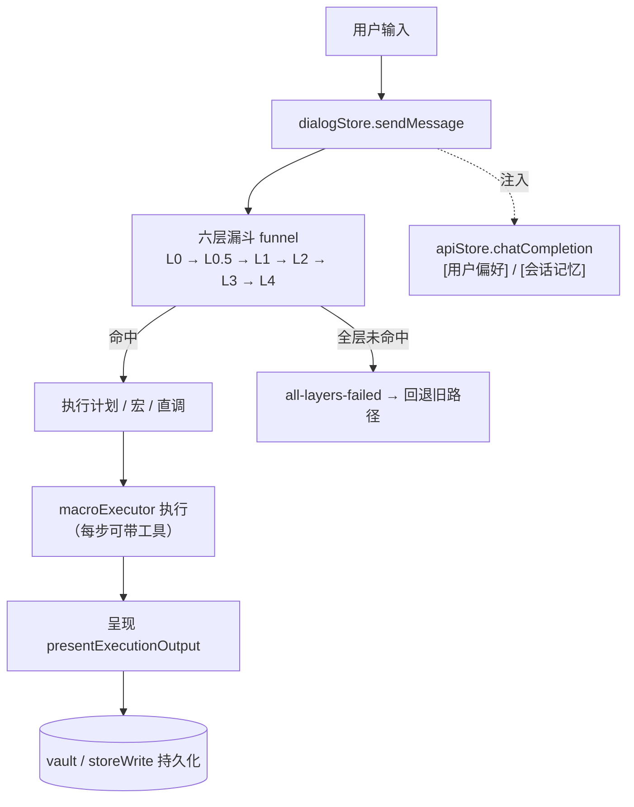

# HoloStarmap 对外总览（按代码取证）

> **撰写原则**：本文件每条数字都标注来源（`文件:行` 或实测命令）。凡未逐条核实的一律显式标注 **[未核实]**。
> 本项目 `docs/` 下的历史文档**系统性滞后于代码**（见 §0），故本文件不引用它们的结论，只引用代码与实测。
> 生成时间：2026-10-07 · 对应 HEAD：`e8dfb00` · 分支 `feat/model-collaboration`

---

## 0. 先纠正四处对外口径（这些数字与代码对不上）

对外发布前必须先改，否则是硬伤：

| 位置 | 声称 | **实测** | 证据 |
|---|---|---|---|
| `README.md:110` | 测试 1685 个、100% 通过 | **2652 passed / 1 failed**（唯一失败为 Ollama 运行时已知环境噪声） | `npm test` |
| `README.md:136` | shell 白名单 19 条 | **12 条** | `electron/shell-security.ts:4` 起数组 |
| `README.md:137` | 危险模式正则 77 条 | 数组实际条目数与 77 不符（`NODE_E_DANGEROUS_PATTERNS` 等）；**需按代码重算后写出** **[未核实：完整黑名单由多个数组组成，未逐个数完]** | `electron/shell-security.ts:38` |
| `README.md:40` | token 节省 39–49% | **本会话未复现该数字**；实测口径见 §5 | 本会话实测 |

另外 `docs/` 里多份文档的「未修清单」**已过期**（例：`docs/2026.9.27.1-30快照.md` 的 F-8 / K-2 / K-4 / T-2 / D-1 经 `grep` 复核**均已修**）。**动 docs 前先 grep 代码。**

---

## 1. 它是什么

一个**本地优先的 AI 工具控制台**（Electron + Vue 3 + TypeScript strict）：路由、校验、优化你的 LLM 调用。
不上云后端，密钥留在本机磁盘（`electron/safeStorage` + vault）。

- 版本 `0.1.0`，Electron `33.4.0`，Vue `^3.5.0`（`package.json`）
- 渲染进程 `src/`（Vue3 + Pinia + 内核装配）+ 主进程 `electron/`（窗口 / IPC / 安全 / 文件）
- 源码规模：`src` + `electron` 下 `.ts`/`.vue` 共 **244** 个文件

---

## 2. 架构总览



- 编排核：`src/kernel/funnel.ts`（层序 `LAYER_ORDER`，门值 `FunnelGates`）
- 默认内核插件：`src/kernels/default/`
- 领域热插拔：`src/domains/`（如 `src/domains/dialog/handlers.ts`）

---

## 3. 一个请求怎么走（实测）

真实运行日志（CDP 抓取，用户输入「1+1等于几？」）：

```
[Router] funnel(L4) → 1+1等于几？ | macro=无 | auto=true
```

`routeKind` 只记「层产出计划的种类」（`plan`/`candidates`/…），**区分不出是第几层**；
真正的层在 `source` 字段 —— 2026-10-07 起已记入验收报告（`ExamQuestionResult.routeLayer`，commit `5ad0ed1`）。

---

## 4. 工具能力

- **常驻原生工具 14 个**（`src/services/nativeTools.ts:15` 的 `NATIVE_TOOL_NAMES`）：
  `shell_exec` / `read_file` / `list_directory` / `file_write` / `file_move` / `file_copy` /
  `file_convert` / `create_docx` / `rename_images_by_date` / `image_process` / `media_process` /
  `doc_extract` / `search_files` / `file_edit`
- **MCP 工具**：按已连接连接动态注入（`buildMcpTools()`），与原生工具同表下发。
- 两条 renderer 分发器必须同集（`macroExecutor.callToolDirectWithTier` 与 `dialogStore.executeToolCall`），
  由 `test/unit/toolDispatchParity.spec.ts` 用源码级断言守住。

---

## 5. 省 token：**实测口径**（不是宣称）

用 CDP 给 `apiStore.chatCompletion` 打桩实测（`.rivet/scratch/measure-args.mjs`）：

### 5.1 一次普通请求的构成

| 项 | 实测值 |
|---|---|
| LLM 调用次数 | **1 次** |
| messages | 1444 字符 |
| **tools（14 个工具 schema）** | **5832 字符（占 payload 80%）** |
| prompt / completion | ≈ 3482 / 211 token |

**结论**：开销是**每次请求固定背着的工具定义**，**不是**"多调一次规划调用"。
（曾据 `routeKind=plan` 误判为"全走 LLM 规划"，2026-10-07 已证伪并纠正。）

### 5.2 真正省 token 的地方

| 机制 | 实测 |
|---|---|
| **L2 宏命中** | **+0 token**（实测「写本周周报」走 `l2-weekly-report-draft-v1`，token 增量 0） |
| 语义缓存 | 有命中记录（`mechanismStats.cache`，实测样本 hitRate 0.5） |
| ZOL 自适应阈值 | **此前从不生效**（`initFromVault()` 是死代码、阈值恒为默认值），**已修**（commit `dab9360`） |

### 5.3 已知的"花冤枉钱"路径（未修，需你裁决）

每次请求约 3.5K 固定 token 中 80% 是工具 schema。**但不能简单删**：
`macroExecutor.ts:581` 挂 `tools` 是**有据的修复**（注释原文：此前宏步骤完全不传 tools ⇒ 模型回「我无法访问你电脑上的本地路径」⇒ 考试 Q15 失败）。**去掉即回归。**

---

## 6. 记忆三层（实测，含未修项）

| 层 | 机制 | 状态 |
|---|---|---|
| **同会话多轮** | 对话窗口（`buildChatHistory`，2026-10-07 起改为字符预算：下限 3 / 上限 20 / 6000 字符）+ `[会话记忆]` 8 条 | ✅ 已修（此前窗口固定 3 条） |
| **宏路径的历史** | `buildMacroLlmMessages` + `[近期对话]` | ✅ 2026-10-07 修复：此前**一条历史 user 轮次都没有**（`getRecentAssistantOutput` 只返最近一条 assistant） |
| **长期（偏好）** | `memoryStore.globalMemory.preferences` → 作 system 前缀注入 | ✅ `apiStore.ts:545` |
| **跨会话** | 会话快照持久化；`holo-session-archive` 保留**最近 20 段** | ⚠️ 恢复默认**关**（`configStore.ts:29` `restoreSessionMemoryOnStartup=false`）——"一次运行一个会话"，需用户手动开启 |
| **项目记忆** | `memoryStore.projectMemories` | ❌ **只被 KnowledgeManager 界面读，从未注入对话、也从未被检索**；且结构里没有会话消息（`{id,name,fileFingerprints,knowledgeEntryIds,vectorIndex}`）。⇒「把会话合并进项目后对话时查不到」 |

**验证手段（可复跑）**：`.rivet/scratch/verify-context-injection.mjs` —— 断言第 2 次请求 payload 里含第 1 次用户说过的话。

---

## 7. 安全模型

- **shell 白名单**：`electron/shell-security.ts:4` 起，12 条前缀。
- **危险模式**：同文件 `:38` 起（`NODE_E_DANGEROUS_PATTERNS` 等）。**[未核实：完整清单未逐条数完]**
- **路径校验**：`electron/pathValidator.ts`（`validateReadPath` / `validateWritePath` / `DANGEROUS_EXTENSIONS`）。
- **写类工具授权**：`writeGate`（`src/services/writeGate.ts`）+ 风险确认条（三态：拒绝 / 本次允许 / 始终允许）。
- **fail-closed 取向**：安全判定拿不准时**拒绝**而非放行（见项目约定与 `docs/SECURITY.md`）。

---

## 8. 验收（考试系统）

- 题库：V1（18 题）、V2（**50 题**），源码 `src/exam/examCases.ts` / `examCasesV2.ts`。
- 运行：`src/exam/examRunner.ts`；报告结构见 `ExamReport`。
- 指标：`deliverableRate`（可交付率）/ `zeroInterventionRate`（零干预率）/ `avgDurationMs` / `totalTokens`。
- 最近留档：`docs/exam-reports/2026-10-07-v2-after-fixes.json`（**数字请以该文件 summary 为准，不要引用二手转述**）。
- **注意**：同一题库跨轮次波动大（历史记录 28%–42%），**单轮只能当信号，不能当结论**。

---

## 9. 测试与验证（覆盖边界要如实说）

- spec 文件 **199** 个：`test/unit` **171**、`test/integration` **7**、`test/chaos` **1**、`test/e2e` 若干、根 `test/` 17。
- **unit 占约 88%**；且 **30 个 spec 直接 `stubGlobal('window')` 把 `electronAPI` 打桩** —— 真实文件系统/IPC 边界在测试里是假的。
- **真机端到端不在 CI**：靠 CDP 探针脚本（`.rivet/scratch/`：`scenario-probe.mjs` / `repro-recall.mjs` / `verify-context-injection.mjs` 等）人工驱动运行中的应用。
- 结论：`npm test` 全绿**不等于**真实场景可用。已知唯一常驻失败 `test/unit/apiStore.timerDispose.spec.ts` 在 **Ollama 运行时**必失败（属已知环境噪声）。

---

## 10. 已知边界与未完成（诚实清单）

1. **项目记忆不参与对话**（§6）——合并会话后检索不到。
2. **领域包设计未着手**（`docs/领域包-现状评审与待填清单.md` 仅为底料）。
3. **用户可见文案未统一**：项目有 `src/services/terminologyMap.ts`（technical/plain 两档），但只被配置面板用；对话文案仍是硬编码字符串。2026-10-07 已把最刺眼的黑话（RaaP/L0 Skill/探索模式）改成人话，但**未收口到术语表**。
4. **README / docs 口径滞后**（§0 已纠正四处）。
5. **端到端场景测试未自动化**（§9）。
6. **截图能力在本机不稳定**：CDP `Page.captureScreenshot` 间歇性挂死（曾多次复现），UI 验收目前依赖 DOM 计算样式与像素采样，而非截图。
7. **L3 装饰占位 98 个保留**：那是作者预留位，`docs` 里"清理 L3"的建议**已过期，不要照做**。

---

## 11. 关键文件索引

| 关注点 | 文件 |
|---|---|
| 六层路由编排 | `src/kernel/funnel.ts` |
| L0/L0.5 规则与快配 | `src/services/l0SkillRouter.ts` |
| 宏执行与工具直调 | `src/services/macroExecutor.ts` |
| 对话与工具分发（renderer） | `src/stores/dialogStore.ts` |
| LLM 调用与注入（偏好/会话记忆） | `src/stores/apiStore.ts` |
| 原生工具定义 | `src/services/nativeTools.ts` |
| 终端安全 | `electron/shell-security.ts` / `electron/pathValidator.ts` |
| 验收考试 | `src/exam/examRunner.ts` / `src/exam/examCasesV2.ts` |
| 三档主题令牌 | `src/styles/tokens.css` |

---

## 附：本文件自身的可信度声明

- §5 / §6 的数字来自**本会话在运行中的应用里实测**（CDP 打桩与 DOM 采样），探针脚本保留在 `.rivet/scratch/`。
- §1 / §4 / §9 来自**代码与命令计数**（`grep` / `find` / `wc`）。
- §7 的完整清单与 §8 的具体成绩**未逐条核实**，已标注；对外引用前请复核。
