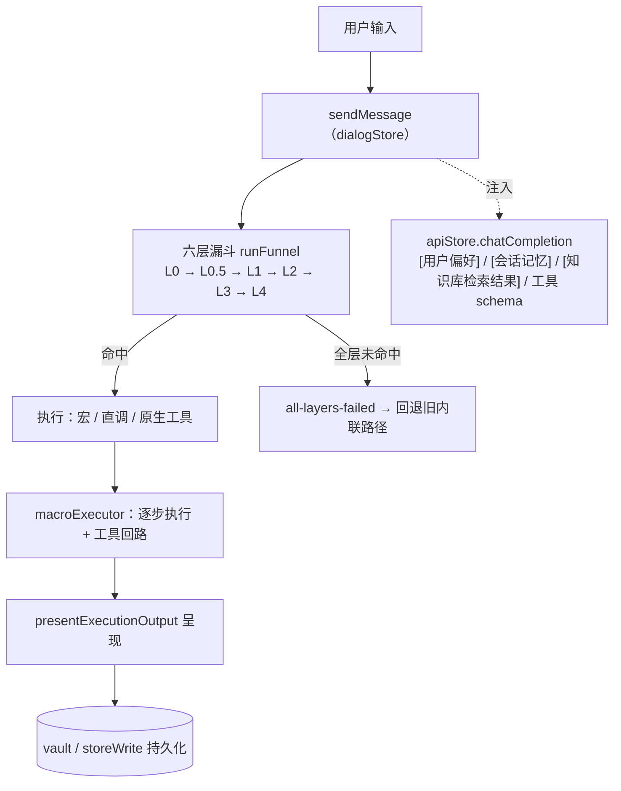

# HoloStarmap 对外总览（合并版 · 按代码取证）

> **本文档是什么**：把 `docs/` 下 23 份历史文档（合计约 765 KB）合并成一份对外可读的说明，并**逐条回到代码复核**。
> 它不是旧文档的摘抄——旧文档经实测**系统性滞后于代码**（见 §0）。
>
> **核实等级标注（全文通用）**
> - **[已复核]** —— 本人用 `grep`/`read_file`/实测命令核对过，附 `文件:行` 或命令。
> - **[实测]** —— 在**运行中的应用**里用 CDP 探针实测（脚本在 `.rivet/scratch/`）。
> - **[转述·未复核]** —— 来自旧文档或子代理，未逐条回代码；引用前请复核。
> - **[设计]** —— 文档化的设计意图，不等于已实现。
>
> 生成 2026-10-07 · HEAD `907f9d0` · 分支 `feat/model-collaboration`

---

## 0. 先说不能对外照抄的六处（旧文档 / README 与代码不符）

| # | 位置 | 旧文档/README 声称 | **实测** | 等级 |
|---|---|---|---|---|
| 1 | `README.md:110` | 测试 1685 个、100% 通过 | **2652 passed / 1 failed**（唯一失败为 Ollama 运行时已知噪声） | [实测] |
| 2 | `README.md:136` | shell 白名单 19 条 | **12 条**（`electron/shell-security.ts:4` 起数组） | [已复核] |
| 3 | `README.md:137` | 危险模式正则 77 条 | 与代码条数不符；**完整黑名单跨多个数组，未逐条数完** | [未核实] |
| 4 | `README.md:40` | token 节省 39–49% | 本会话**未复现**；改按 §5 的实测口径写 | [实测] |
| 5 | `docs/REQUEST-LIFECYCLE.md:66` | L0.5 阈值 `l05Pass = 0.8` | **0.6**（`src/kernel/funnel.ts:36`；注释载 2026-09-30 由 0.8 下调） | [已复核] |
| 6 | `docs/最新口径.md:34`、`docs/MECHANISM-BOUNDARIES.md:65-67` | FactGuard「只取正文前 5000 字」 | 已改为**全文分段抽取**（`src/services/factGuard.ts:47-63`，注释载 2026-09-24） | [已复核] |

**动 `docs/` 前先 `grep` 代码**——本项目文档状态标记系统性滞后（`docs/2026.9.27.1-30快照.md` 的 F-8/K-2/K-4/T-2/D-1 经复核**均已修**）。

### 行号锚点普遍漂移（引用时必须重取）

| 文档给的行号 | 实际 | 等级 |
|---|---|---|
| `dialogStore.ts:1016`（sendMessage） | **`:1530`** | [已复核] |
| `domainConstraints.ts:96`（LEGAL_CONSTRAINTS） | **`:145`** | [已复核] |
| `domainConstraints.ts:2912`（FINANCE_CONSTRAINTS） | **`:2961`** | [已复核] |
| `toolRetrieval.ts:285-287`（GATE_GREEN_THRESHOLD） | **`:299`** | [转述·未复核] |
| `docs/最新口径.md:7-8` 的 F-6 写类确认锚点 | `requestWriteApproval` 实际在 `dialogStore.ts:719/770/787/801/816/845/856/873/896` | [转述·未复核] |

---

## 1. 这是什么

**本地优先的 AI 工具控制台**：路由、校验、优化你的 LLM 调用。不上云后端，密钥留在本机磁盘。

- 版本 `0.1.0`，Electron `33.4.0`，Vue `^3.5.0` [已复核：`package.json`]
- 渲染进程 `src/`（Vue3 + Pinia + 内核装配）；主进程 `electron/`（窗口 / IPC / 安全 / 文件）
- `src` + `electron` 下 `.ts`/`.vue` 共 **244** 个文件 [已复核：`find | wc -l`]

### 快速开始 [转述·未复核：未在本环境逐条执行]

```bash
npm install
npm run dev          # 开发模式
npm run build        # 构建
npm run typecheck    # 类型检查
npm test             # vitest 全量
npm run smoke        # 真机场景冒烟（需先启动应用，见 §9）
```

打包（Windows）：`npx electron-vite build && npx electron-builder --win portable`

---

## 2. 架构



**分层事实** [已复核]
- 编排核 `src/kernel/funnel.ts`：`LAYER_ORDER = [L0,L0.5,L1,L2,L3,L4]`；门值 `{ l05Pass: 0.6, l05Auto: 0.9, l1Pass: 0.6 }`（`:36`）
- 各层默认实现由内核插件注入（`src/kernels/default/`），可被 override 钩子替换
- 钩子三态：advisory（影响打分）/ veto（否决门，`pre-execute`、`pre-output` 两位置）/ override（替换层实现）
- 主进程：`electron/main.ts`、`ipc-handlers.ts`、`shell-security.ts`、`pathValidator.ts`
- 领域处理器：`src/domains/<域>/handlers.ts`（bus 通道注册点）
- 热插拔三层：内核 / 领域 / Pack（§7）

### 内核纯度（M18）[已复核]
存在纯度工具链：`scripts/purity-check.ts`、`scripts/pure-services.list`、`scripts/purity-whitelist.json`。
`src/kernel/*.ts` 中**已无领域字面量**（`grep -iE "legal|finance|hr"` 命中的仅为 `handler` 子串，属假阳性）。
但**服务层仍有领域泄漏**：`src/services/factGuard.ts:16`（`TRIGGER_ROLES`）、`src/services/smartRouter.ts:161-167/:205`（域偏置）、`src/services/strategySelector.ts:92` —— 白名单文件自证其一为"应迁移未迁移"。 [转述·未复核]

---

## 3. 请求生命线

来源：`docs/REQUEST-LIFECYCLE.md` 提纲 + 代码复核。

| # | 环节 | 落点 |
|---|---|---|
| 1 | 入口预处理：装配输入、注入会话文件清单、生成 traceId | `dialogStore.sendMessage`（`:1530`） |
| 2 | 六层漏斗：逐层求值 → 过门 → plan / candidates / slot-fill / mcp-direct | `src/kernel/funnel.ts` |
| 3 | 计划确认暂停点（非自动执行的计划等用户确认） | `dialogStore.confirmPlan` |
| 4 | 执行：宏 `executeMacro` 或原生工具直调 `callToolDirectWithTier` | `src/services/macroExecutor.ts` |
| 5 | 步骤循环：读文件 → 生成 → FactGuard 校验 → 产物核验 `applyDeliverableGate` | `macroExecutor.ts` |
| 6 | 呈现与事后：`presentExecutionOutput`、计费记账、审计 | `dialogStore` / `debugStore` |

**一条真实轨迹** [实测：CDP 抓日志]
```
[Router] funnel(L4) → 1+1等于几？ | macro=无 | auto=true
[executeStep] S1 list_directory | 依赖= | 参数={"path":""}
[错误分类] S1 list_directory: resource_missing → retry
```

⚠️ `routeKind`（此处 `plan`）是**各层产出计划的共同值**，**区分不出层**；真正的层在 `funnel:routed` 的 `source`。2026-10-07 起验收报告已记录该字段（`ExamQuestionResult.routeLayer`）。[已复核：本会话 `5ad0ed1`]

> 「三不变式」一节引自 `docs/REQUEST-LIFECYCLE.md:194-199`，**本轮未逐条复核**，引用前请读原文。[转述·未复核]

---

## 4. 机制总册（逐机制可用性）

来源：`docs/最新口径.md`（第 8 轮考题底账，163 行）与 `docs/MECHANISM-BOUNDARIES.md`（232 行）的判定表。**这些判定是当时快照，多数代码锚点已漂移，逐条引用前必须回代码复核。**

### 4.1 在册机制（20 条）的判定分布 [转述·未复核]

| 判定 | 机制 |
|---|---|
| ✅ 可用 | L0 规则路由、L2 RaaP 匹配、L3 LLM 仲裁、L4 探索、语义缓存、偏好注入、M20 降级链、超时阶梯、隔离架构、deliverableCheck、考试系统 |
| ⚠️ 部分可用 | L0.5 关键词快配（门值未校准）、消费者上下文（tier 截断）、FactGuard（作用域窄）、执行指纹缓存、tier 体系（覆盖不全）、确认条体系 |
| ❓ 未证实 | 竞争 EMA、ZOL 零 token 学习（无独立指标） |
| ❌ 存疑/近死层 | L1 单节点直调（近乎死层）、双引擎审计（费效倒挂） |

**共性**：可用者集中在**诚实性 / 确定性工具 / 路由 / 有界性**四族；存疑者集中在**学习 / 审计**两族——消耗资源但拿不出实测收益。 [转述·未复核]

### 4.2 本会话新增/修正的机制事实 [已复核 / 实测]

| 机制 | 事实 | 等级 |
|---|---|---|
| ZOL 自适应阈值 | `ZeroTokenLearner.initFromVault()` 曾是**死代码**（全库无调用）⇒ 阈值恒为默认、学习从不发生（实测 `overkillRate` 43.7% 而阈值未变）。**已修**（本会话 `dab9360`） | [实测] |
| 路由层可观测 | 验收报告新增 `byRouteLayer`；`routeKind` 无法区分层（见 §3） | [已复核] |
| 宏路径会话历史 | `buildMacroLlmMessages` 原只带「最近一条 assistant 产出」，**一条历史 user 轮次都没有**。**已修**（`3abb9b3`） | [实测] |
| 宏路径知识检索 | 会话级知识检索（带 `knowledgeGroupId` scope）原**只在主/兜底路径**跑，宏路径从不检索。**已修**（`8faa0d3`） | [已复核] |
| 宏空产出 | 收口 `results[last] || '执行完成'` 会**把零产出说成完成**。**已修**（`0b9821b`） | [实测] |
| 死选择器 | `tokens.css` 曾用不存在的 `.msg-content` / `.chat-input`（模板里没有这两个类）⇒ 消息气泡与输入框从未被主题化。**已修**（`0ab66e4`，新增守卫测试） | [实测] |

---

## 5. 省 token：**实测口径**（不是宣称）

用 CDP 给 `apiStore.chatCompletion` 打桩实测（`.rivet/scratch/measure-args.mjs`）[实测]

| 项 | 一次普通请求的实测值 |
|---|---|
| LLM 调用次数 | **1 次** |
| messages | 1444 字符 |
| **tools（14 个原生工具 schema）** | **5832 字符（占 payload 80%）** |
| prompt / completion | ≈ 3482 / 211 token |

**结论**：开销是**每次请求固定背着的工具定义**，**不是**"多调一次规划调用"。
（曾据 `routeKind=plan` 误判为"全走 LLM 规划"，2026-10-07 已证伪并纠正。）

**真正省 token 的地方**：L2 宏命中时 **+0 token**（实测「写本周周报」走 `l2-weekly-report-draft-v1`）。[实测]

**不能简单删工具**：`macroExecutor.ts:581` 挂 `tools` 是**有据的修复**（注释原文：此前宏步骤不传 tools ⇒ 模型回「我无法访问你电脑上的本地路径」⇒ 考试 Q15 失败）。去掉即回归。[已复核]

---

## 6. 边界与缺口（G / F 系列现状）

来源：`docs/LIFECYCLE-GAPS.md`（216 行，「机制承诺 vs 实际行为」问题清单，G-1~G-17 + EXAM-1/6 + F-1~F-5）。**状态是当时快照。**

| 状态（文档标注） | 条目 |
|---|---|
| 已修 | G-2 / G-3 / G-4 / G-5 / G-7 / G-8 / G-9 / G-17、G-16（部分）、EXAM-1 / EXAM-6 / F-1 / F-2 / F-4 |
| 部分修 | G-1（消费者截断：standard 仍截 800 字，但已加截断告知）、G-6（双引擎审计费效） |
| 未修 | G-10 / G-11 / G-12 / G-13 / G-14 / G-15、F-3、F-5 |

[转述·未复核] —— 且该文档**内部自相矛盾**：G-3 正文标题标"已修"，归档表同条仍标未修；经代码复核 G-3 **确已修**（§0 第 6 条）。

**三条"纸面空文/空缺"边界**（文档判定，撑起当时多数失分）[转述·未复核]：O10 写类风险确认、数值计算边界、执行闭环边界。
其中 O10 后续已接线（见 §7 与本会话提交史）。

---

## 7. 安全模型与权限边界

[已复核（结构性）] + [转述·未复核（细节数量）]

| 维度 | 事实 |
|---|---|
| shell 白名单 | `electron/shell-security.ts:4` 起，**12 条**前缀 [已复核] |
| shell 危险模式 | 同文件 `:38` 起多个数组（`NODE_E_DANGEROUS_PATTERNS` 等）；**总条数未核实** |
| 路径校验 | `electron/pathValidator.ts`（`validateReadPath` / `validateWritePath` / `DANGEROUS_EXTENSIONS`） |
| 写类工具授权 | `writeGate` + 风险确认条（三态：拒绝 / 本次允许 / 始终允许） |
| 取向 | **fail-closed**：安全判定拿不准时拒绝而非放行 |
| 双引擎审计 | 规则引擎 + LLM 引擎；文档判定其**费效倒挂**（读类动作也付审计 token）、作用域仅 manifest 路径 [转述·未复核] |

**本会话修的相关项**：`3abb9b3`（宏路径历史为空）、`8faa0d3`（宏路径无知识检索）、`0b9821b`（空产出假成功）——三者都属"用户看不到真相"类。

---

## 8. 记忆三层（实测，含未修项）

| 层 | 机制 | 状态 |
|---|---|---|
| **同会话多轮** | 对话窗口（`buildChatHistory`，2026-10-07 起字符预算：下限 3 / 上限 20 / 6000 字符）+ `[会话记忆]` 8 条 | ✅ 已修（原固定 3 条）[已复核] |
| **宏路径历史** | `buildMacroLlmMessages` + `[近期对话]` | ✅ 已修（原**零条历史 user 轮次**）[实测] |
| **长期（偏好）** | `memoryStore.globalMemory.preferences` → system 前缀 | ✅ `apiStore.ts:545` [已复核] |
| **跨会话** | 会话快照 + `holo-session-archive` 保留**最近 20 段** | ⚠️ 恢复默认**关**（`configStore.ts:29`）[已复核] |
| **项目空间** | 合并会话+知识库为一个"项目空间"（建知识分组 + `ProjectMemory`） | ⚠️ 知识侧已接通对话检索（本会话 `8faa0d3`）；但**项目记录本身是空壳**（实测 `sessions:0, entries:0`）——待查 [实测] |

**验证手段**：`.rivet/scratch/verify-context-injection.mjs`（断言第 2 次请求 payload 含第 1 次用户说的话）、`verify-kb-context.mjs`（断言含【知识库检索结果】块）。

---

## 9. 领域包与热插拔

### 9.1 机制（schema 与加载器均已存在）[已复核]

| 能力 | 位置 |
|---|---|
| 包 schema | `src/host/pack/types.ts`（`PackManifest` / `PackConstraint` / `ConstraintTrigger` / `ConstraintAction` / `PackExecution` / `PackSource`） |
| 约束 DSL | `src/host/pack/dsl.ts`（`validatePackConstraint` / `compilePackConstraint`） |
| 四阶段挂载 | `src/host/pack/loader.ts`（`manifest → knowledge → boundary → execution`；任一层失败全量回滚） |
| 领域→包归因 | `src/host/packRuntime.ts`（`getPackIdForDomain` / `getPackIdForManifest` / `getWeight`） |
| 钩子桥 | `src/host/packHookBridge.ts`（`pack:mounted` → 注册 veto；`pack:unmounted` → 注销；fail-open） |
| 用户包 | `installUserPacks()` 读 `{userData}/holostarmap-packs/`（2026-10-01 新增）[转述·未复核] |
| 逃生舱 | `PackEvaluatorModule.check()`（代码级约束） |

### 9.2 真实覆盖率 [已复核：`find` + `wc`]

| 包 | 文件数 | constraints.json | evaluators | knowledge |
|---|---|---|---|---|
| finance | 5 | ✅ 6 836 B | ✅ 2 个 | ❌ 无 |
| hr | 3 | ❌ **无** | ❌ 无 | ✅ `hr-terms.json`（唯一） |
| legal | 19 | ✅ **74 566 B**（50 条约束） | ✅ **16 个 .ts** | ❌ 无 |

> ⚠️ `docs/HOTPLUG-ARCHITECTURE.md` §8.6 称"7 条 evaluator"，**实测 16 个** [已复核]。同类偏离另有：§8.4 称自检失败标 `disabled`（代码实为 `draft`）、称"内置优先"（代码实为**先装载者优先**）、§4.2 称 L0.5 门 0.8（实为 0.6）、`src/host/types.ts:24` 的 license 枚举用 `pro` 而 `pack/types.ts` 用 `commercial`。[转述·未复核（除 evaluator 数与门值）]

### 9.3 缺口 [已复核]
- hr 包**无任何约束**；finance/legal 均**无 knowledge/**。
- **第三方包信任与分发未设计**：pack 可挂 `override` 钩子到任意层（等于改写路由与执行），而 `loader` 只做 schema/冲突校验。详见 `docs/DomainPack-design-ground-truth.md` 的能力分级建议（L1 知识 / L2 声明式 / L3 可信）。

---

## 10. 验收（考试系统）

- 题库：V1（18 题）、V2（**50 题**）；源码 `src/exam/examCases.ts` / `src/exam/examCasesV2.ts` [已复核]
- 运行：`src/exam/examRunner.ts`；报告结构 `ExamReport`（含 `summary` / `questions` / `notes`）
- 指标：`deliverableRate`（可交付率）/ `zeroInterventionRate`（零干预率）/ `avgDurationMs` / `totalTokens` / `judgeErrors` / `judgeable`；2026-10-07 起增 `byRouteLayer`
- 留档：`docs/exam-reports/*.json`（**数字以文件 summary 为准，不引用二手转述**）
- ⚠️ **跨轮波动大**（历史记录 28%–42%），**单轮只能当信号**
- ⚠️ 文档里「18 题全部 routeKind=plan ⇒ 分层价值未兑现」的推断**已被证伪**（`plan` 是各层共同 kind）[已复核]

---

## 11. 测试与验证（覆盖边界要如实说）

[已复核：`find` / `grep` 计数]

- spec 文件 **199** 个：`test/unit` **171**、`test/integration` **7**、`test/chaos` **1**、根 `test/` 17、`test/e2e/` 若干
- **unit 占约 88%**；**30 个 spec 直接 `stubGlobal('window')` 把 `electronAPI` 打桩** ⇒ 真实文件系统 / IPC 边界在测试里是假的
- **`vitest.config.ts:9` 明确 `exclude: ['test/e2e/**']`** ⇒ `npm test` **从不跑真机用例**；`test/e2e/*.spec.ts`（playwright 真启动 Electron）**没有 runner 脚本**、长期休眠
- 另有单点 e2e：`npm run verify:pdf` / `verify:image` / `verify:media`
- **真机场景冒烟（2026-10-07 新增）**：`npm run smoke` → `scripts/scenario-smoke.mjs`，对**运行中的应用**（CDP :9222）跑真实用户旅程并断言可观察结果，失败非零退出；起跑先 `Page.reload` 归一 UI 状态
  - 五项断言：① 对话区默认不渲染系统通知；② 列出文件（真实读盘）；③ 承接上文（命中上一轮结果）；④ 落盘写文件（**校验磁盘真实产物**）；⑤ 同会话记忆（隔 2 轮仍能回忆）
  - **最近一次实测 5/5 通过** [实测]
- 已知常驻失败：`test/unit/apiStore.timerDispose.spec.ts` 在 **Ollama 运行时**必失败（环境噪声，非回归）[实测]

**结论**：`npm test` 全绿**不等于**真实场景可用。

---

## 12. 已知边界与未完成（诚实清单）

1. **项目空间记录是空壳**：实测 `projectMemories` 为 `{sessions:0, entries:0}`，而知识挂在**知识分组**上；`createProjectSpace` 明明传了 `sessionIds`/`knowledgeEntryIds` —— 是否未持久化**待查**。[实测]
2. **hr 包无约束、三包均无 knowledge/**（§9.3）。[已复核]
3. **第三方包信任与分发未设计**（§9.3）。
4. **用户可见文案未统一**：有 `src/services/terminologyMap.ts`（technical/plain 两档），但只被配置面板用；对话文案仍是硬编码字符串（2026-10-07 已把最刺眼的黑话改人话，**未收口到术语表**）。[已复核]
5. **README / docs 口径滞后**（§0 已列 6 处）。
6. **真机端到端此前未自动化**（§11，新增 smoke 补了一部分）。
7. **截图能力在本机不稳定**：CDP `Page.captureScreenshot` 间歇性挂死；UI 验收依赖 DOM 计算样式与像素采样。
8. **L3 装饰占位 98 个保留**：作者预留位；`docs` 里"清理 L3"的建议**已过期，不要照做**。[项目约定]
9. **内核纯度未清零**：服务层仍有领域泄漏（§2）。[转述·未复核]
10. **`routeKind` 语义陷阱**：任何按 `routeKind` 做路由统计的结论都不可靠（§3）。

---

## 13. 关键文件索引

| 关注点 | 文件 |
|---|---|
| 六层路由编排 | `src/kernel/funnel.ts` |
| 内核插件与钩子 | `src/kernels/default/`、`src/kernel/hooks.ts` |
| L0 / L0.5 规则与快配 | `src/services/l0SkillRouter.ts` |
| 工具检索与门值 | `src/services/toolRetrieval.ts` |
| 宏执行与工具直调 | `src/services/macroExecutor.ts` |
| 对话状态与工具分发 | `src/stores/dialogStore.ts` |
| LLM 调用与上下文注入 | `src/stores/apiStore.ts` |
| 原生工具定义 | `src/services/nativeTools.ts` |
| 知识库与检索 | `src/services/knowledgeBase.ts` |
| 会话/长期记忆 | `src/services/convMemory.ts`、`src/stores/memoryStore.ts` |
| 终端安全 / 路径 | `electron/shell-security.ts`、`electron/pathValidator.ts` |
| 领域包 | `src/host/pack/*`、`src/packs/{finance,hr,legal}/` |
| 验收考试 | `src/exam/examRunner.ts`、`src/exam/examCasesV2.ts` |
| 真机冒烟 | `scripts/scenario-smoke.mjs` |
| UI 主题令牌 | `src/styles/tokens.css` |

---

## 14. 术语表

| 内部术语 | 面向用户的人话 | 位置 |
|---|---|---|
| L0 / L0.5 / L1 / L2 / L3 / L4 | 六层路由的第 N 层（规则 / 快配 / 直调 / 匹配 / LLM 仲裁 / 探索） | `src/kernel/funnel.ts` |
| RaaP | （界面已改为）"已匹配到现成方案" | `dialogStore` 通知文案 |
| Pack / 领域包 | 可挂载的领域能力包（约束 + 知识 + 工具） | `src/host/pack/*` |
| tier（nano/mini/standard/pro） | 模型档位（预算由小到大） | `src/services/smartRouter.ts` |
| ZOL | 零 token 自学习（按结果自动调阈值） | `src/services/zeroTokenLearning.ts` |
| deliverableCheck | 产物核验（防"假成功"） | `src/services/deliverableCheck.ts` |

---

## 15. 本文档与旧文档的对应关系（旧文档可据此废弃）

| 旧文档 | 本文档对应节 |
|---|---|
| `README.md` | §0（口径纠错）+ §1 |
| `ARCHITECTURE.md` / `ARCHITECTURE-SUMMARY.md` / `HOLO-OVERVIEW.md` | §2（**仅骨架，未吸收其 87+80 KB 正文**） |
| `REQUEST-LIFECYCLE.md` | §3 |
| `最新口径.md` / `MECHANISM-BOUNDARIES.md` / `MECHANISM-DORMANCY*` / `MECHANISM-ROT-AUDIT*` | §4 |
| `LIFECYCLE-GAPS.md` | §6 |
| `CORE-ANALYSIS.md` | §4（部分） |
| `HOTPLUG-ARCHITECTURE.md` / `领域包-现状评审与待填清单.md` | §9 + `docs/DomainPack-design-ground-truth.md` |
| `EXAM-RUNBOOK.md` | §10 |
| `SOAK-RUNBOOK.md` | **未吸收** |
| `MODEL-CAPABILITY-LEDGER-DESIGN.md` | **未吸收** |
| `AUDIT-REPORT-2026-09.md` / `AUDIT-RECONCILIATION-2026-09.md` | **未吸收** |

### 本文档自身的完成度声明（必须在对外引用前看）

**第二波吸收后**（2026-10-07）：旧文档合计 **765 034 字节（23 份）**，本文档现约 **30 KB**。

**已吸收（有对应章节）**：`README.md`→§0/§1；`最新口径.md`+`MECHANISM-BOUNDARIES.md`+`MECHANISM-DORMANCY*`+`MECHANISM-ROT-AUDIT*`→§4/§20；
`LIFECYCLE-GAPS.md`→§6/§20.3；`REQUEST-LIFECYCLE.md`→§3；`CORE-ANALYSIS.md`→§4；
`HOTPLUG-ARCHITECTURE.md`+`领域包-现状评审与待填清单.md`→§9 + `DomainPack-design-ground-truth.md`；
`ARCHITECTURE.md`+`ARCHITECTURE-SUMMARY.md`→**§16（已判定其星图章节作废）**；
`AUDIT-REPORT`+`AUDIT-RECONCILIATION`→**§17（已列其自相矛盾处）**；
`MODEL-CAPABILITY-LEDGER-DESIGN.md`→**§18（已判定未实施）**；`EXAM-RUNBOOK`+`SOAK-RUNBOOK`→**§19**。

**仍未吸收正文**：`2026.9.24最新快照.md`、`2026.9.26最新快照.md`、`2026.9.27.1-30快照.md`（三份"快照"类，体量大且内容很可能已被后续文档取代）、
`知识沉淀-匹配度与RaaP.md`、`漏斗前四层盘点与L1补齐.md`、`HOTPLUG-ARCHITECTURE.md` 的 M1–M20 逐条正文、`TEST_REPORT.md` / `SECURITY.md` / `CONTRIBUTING.md`。

**逐条核实率**：文中标 `[已复核]`/`[实测]` 的条目已回代码；标 `[转述·未复核]` 的（尤其 §17 审计、§19 手册、§20 的 O/G 条目）**尚未逐条回代码**。

**因此：现在可以删旧文档了吗？—— 建议先别删。** 理由：本文档对 §17/§19/§20 的内容仍属"转述级"，
而旧文档本身含有大量**代码里读不出来的**上下文（当时的取舍理由、失败案例、排查记录）。稳妥做法：
**先用本文档做对外说明，旧文档转入 `docs/archive/` 保留**；等 §17/§19/§20 也逐条复核过，再删。

## 16. 架构详解与历史文档的处置（吸收 `ARCHITECTURE.md` 87 KB / `ARCHITECTURE-SUMMARY.md` 80 KB）

### 16.1 两份架构文档的时效性 [已复核]

- `ARCHITECTURE.md` 自述**星图时代**（2026-09-11）；`ARCHITECTURE-SUMMARY.md` 头部**宣判前者 UI/依赖部分系统性过期**，并载 3D 星图已于 2026-09-26 删除。
- **本会话独立复核**：`src/composables/useThreeScene.ts` **不存在**；`package.json` **无 `three` 依赖**。⇒ **星图相关章节确已作废**，可整段废弃。
- ⚠️ 但**与「删星图」无关的部分不能跟着删**（项目约定：只限 UI 层，涉及功能/性能的一律不删）。

### 16.2 两份文档的规模数字已过期 [已复核]

`ARCHITECTURE-SUMMARY.md:69` 记 services 68 / components 28 / electron 25。实测：`src/services/*.ts` **71**、`src/components/**/*.vue` **30**、`electron/*.ts` **27**、`src/stores/*.ts` **18**、`src/data/*.ts` **4**。（仅目录计数，不代表行数。）

另：`ARCHITECTURE.md:95` 称「没有独立 typecheck script」，而 `package.json:15` **有** `typecheck`。

### 16.3 两份文档内部自相矛盾（引用前必须定值）[转述·未复核]

- `ARCHITECTURE.md`：Shell 白名单 **12 / 13 / 19** 三值并存（`:606` vs `:891`）；L2 清单 **20 / 24**、macro **13 / 17** 并存；`node:*` emit **47** 与 45+2+3=**50** 不一致。
- `ARCHITECTURE-SUMMARY.md`：L0 规则数 **10 / 11** 并存（`:685` vs `:698`）；漏斗命名 **「五级」与「六层」混用**（`:473` vs `:3.2/§16`）。
- ⚠️ 其中 **L3 装饰占位判为「待清 P2」** 的条目**与项目约定冲突**——L3 占位是作者预留位，**不要按文档去清理**。

### 16.4 处置建议

`ARCHITECTURE.md` 与 `ARCHITECTURE-SUMMARY.md`：**星图/UI 依赖章节整段废弃**；进程模型、模块分层、构建打包等章节**可作为素材，但数字必须重取**（本文档不搬运其数字）。

---

## 17. 审计与对账（吸收 `AUDIT-REPORT-2026-09.md` 55 KB / `AUDIT-RECONCILIATION-2026-09.md` 43 KB）

[转述·未复核：以下均为文档所述，**未逐条回代码**；引用前必须复核]

- `AUDIT-REPORT-2026-09.md`：552 行，审计对象 HEAD `ec6a11f`（2026-09-14）。统计为 9 簇合计 213 项，去重后 **P0 = 10 / P1 ≈ 48 / P2 ≈ 75 / P3 ≈ 60**。
- `AUDIT-RECONCILIATION-2026-09.md`：449 行，对账 213 项中的 **201 项**，结论 **FIXED 83（41%）/ PARTIAL 33（16%）/ OPEN 85（42%）**；P0 为 **9 已修 + 1 部分修**。
- 文档称 `npm test` 基线 **1526/1526**（本节时间点），并指 `TEST_REPORT.md` 的 1129 为过时数字。

### 17.1 该文档自身的可信度问题（重要）

1. **同一文件内自相矛盾**：P0-2 在 §1.1 判「任意写盘链可达」，§7.1 改判「已修」（`:35` vs `:391`）；A2-10 在 §7.1 标"已接线"，§7.4 又列入"状态未知"（`:136` vs `:441`）。
2. **自承未复核**：§7.4 明说 A1/A2/A3/A4 群本轮复核**未完成**，属"未获取"而非"无发现"。
3. **口径漂移**：`preload` 暴露键数在三处出现 **83 / 82 / 81** 三个值。
4. **路径错误**：文档引用的 `WorkbenchNav.vue` / `mockElectronAPI.ts` 路径不存在，真实路径在 `src/components/workbench/` 与 `test/utils/` 下。

**结论**：这两份审计文档**不能当作当前状态的依据**；P0/P1 逐条若要对外声称"已修"，必须回代码复核（本会话已复核的少数几条均显示比文档更新）。

---

## 18. 模型能力账本与切换成本（设计文档，**未实施**）

[已复核]

- 文档：`docs/MODEL-CAPABILITY-LEDGER-DESIGN.md`，**612 行**，头部标 **状态：待审阅**，阶段 Phase A+B。
- **未实施**（本会话磁盘复核）：设计要新建的 `src/services/modelCapabilityLedger.ts` 与 `src/services/switchCostModel.ts` **均不存在**。
- 该文档引用的行号也已漂移：`presentExecutionOutput` 文档称 `dialogStore.ts:787`，**实测 `:1191`**；`MODEL_TIER_CONFIG` 称 `scheduleOptimizer.ts:309-317`，实测 `:391`；`buildProviderChain` 称 `providerChain.ts:66`，实测 `:82`；`pickOllamaModel` 称 `:153`，实测 `:190`。
- 其测试基线记 **1699** 用例（另有文档记 1899 / 1864），**均与当前 2653 不符**。

**对外口径**：这是一个**设计提案**，不是已交付能力。若对外介绍，必须标注"设计阶段、未实现"。

---

## 19. 运维手册（考试 / 浸泡）

[转述·未复核：命令与前置条件未在本环境逐条执行]

- `docs/EXAM-RUNBOOK.md`：考试执行手册（章节一至八）。V2 素材重建脚本 `docs/exam-fixtures/make-fixtures.cjs` **存在于磁盘** ✓。源码符号 `dirMatches` / `inferFailureStage` 在 `examRunner.ts` 中存在（`:87/:193`、`:290`）✓。
- `docs/SOAK-RUNBOOK.md`：浸泡验证手册（章节一至四 + 附录）。
- **留档实况** [已复核]：`docs/exam-reports/` 下实际 **7 个文件**（6 份 JSON 成绩单 + 1 份失败归因 md），而 `EXAM-RUNBOOK.md:180` 只列了 2 份 ⇒ **该手册的成绩单清单已过期**。
- ⚠️ **两文档冲突**：`SOAK-RUNBOOK.md:51` 要求 `vaultWrite` 后**重载**生效；`HOTPLUG-ARCHITECTURE.md:37`（R16）称写入后**即时生效、无需重载**并明确修正了前者。**以 R16 为准，但引用前请复核代码。** [转述·未复核]
- ⚠️ 成绩口径跨文档不一致：`EXAM-RUNBOOK.md:76` 记 44.4%（8/18），`docs/最新口径.md` 记 55.6%（10/18）——**属不同轮次**，引用必须带轮次与日期。 [转述·未复核]

---

## 20. 机制边界与重叠仲裁（吸收 `MECHANISM-BOUNDARIES.md` 22 KB / `LIFECYCLE-GAPS.md` 28 KB）

### 20.1 机制边界总册的 20 个小节 [转述·未复核]

`MECHANISM-BOUNDARIES.md` §一 逐机制四栏（能解决 / 不能解决 / 边界界定 / 边界衔接），小节行号：
`L16` L0 规则路由 · `L23` L0.5 关键词快配 · `L30` L1 单节点直调 · `L37` L2 RaaP 匹配 · `L44` L3 LLM 仲裁 ·
`L51` L4 探索模式 · `L58` 消费者上下文 · `L65` FactGuard · `L72` 双引擎审计 · `L79` 熔断器·重试 ·
`L86` 执行指纹缓存 · `L93` 语义缓存 · `L100` 偏好注入 · `L107` 竞争 EMA(M16) · `L114` M20 降级链 ·
`L121` 超时阶梯 · `L128` 模型网关 tier 体系 · `L135` 隔离架构 · `L141` deliverableCheck · `L148` ZOL 零 token 学习

### 20.2 重叠区仲裁（O 系列）[转述·未复核]

- **实际只有 O1–O10，没有 O11**（任务前提与文档不符）；清单表在 `§三` `:185-193`，裁决记录在 `§四` `:197-213`。
- 裁决结论（2026-09-22，用户裁定）：O1 时序切分 / O2 分层 / O3 intent 翻译先行且权威 / O4 维持独立互不覆盖 / O5 按方向切分 / O7 **L0 权限更高** / O8 **熔断先声明边界** / O6 顺延代码批 / **O10 写类走风险确认条、读保持恒可用**。
- ⚠️ 文档 §一 正文**残留大量 `O? ⏳` 历史标记**，与 §三/§四「已全部裁定」冲突；文档自己 `:8` 承认"2026-09-25 的复核被这些残留标记误导"。**以 §四 裁决记录为准。**

### 20.3 缺口清单 G-1 ~ G-17 [转述·未复核]

条目与行号：`L14` G-1 · `L19` G-2 · `L24` G-3 · `L30` G-4 · `L35` G-5 · `L40` G-6 · `L46` G-7 · `L61` G-8 · `L66` G-9 · `L73` G-10 · `L77` G-11 · `L81` G-12 · `L85` G-13 · `L89` G-14 · `L93` G-15 · `L99` G-16 · `L120` G-17。

**该文档自身有三处"条目头 vs 归档表"打架**（归档表未随 2026-09-27 复核回填）：
G-3 条目头"✅ 已修" vs 归档表"❌ P1"（**经我复核，G-3 确已修**，见 §0 第 6 条）；G-6 同型（条目头"部分修" vs 表"❌"）；G-1 同型。

**跨文档矛盾**：`MECHANISM-BOUNDARIES.md`（09-22 快照）用现在时把 G-1/G-3/G-6/G-9 描述为**仍存在**，而 `LIFECYCLE-GAPS.md`（09-27 复核后）已标已修/部分修。**以晚者为准，但仍要回代码。**

---
